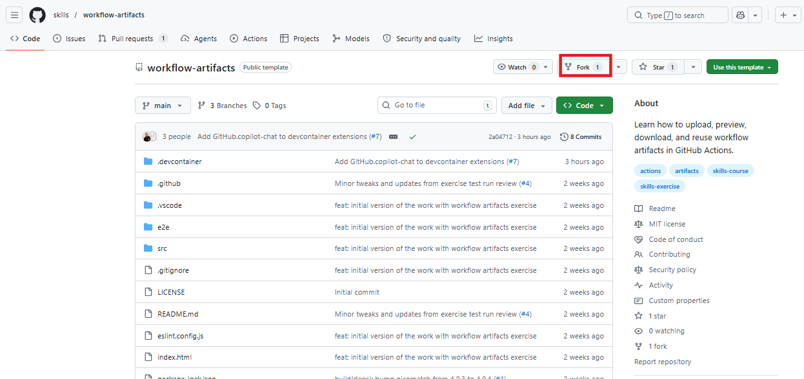

# **Lab 01: Advanced Artifact Handling and Workflow Automation in GitHub Actions**

As a developer on the Octomatch team, you have already established a
robust testing setup that generates valuable reports for your
application. However, accessing and sharing these reports across the
team for every code change can be time-consuming and inconsistent. To
streamline this process, you will leverage GitHub Actions to automate
test execution and store the generated reports as workflow artifacts.
This approach ensures that test results are centrally available, easily
accessible for every workflow run, and can be reused across different
stages of the development and deployment pipeline.

### **Objectives**

- Create and configure GitHub Actions workflows

- Upload workflow artifacts such as test coverage reports

- Enable direct artifact access for browser-based reports

- Run end-to-end (E2E) tests and store results as artifacts

- Download and reuse artifacts across jobs within a workflow

- Share artifacts across different workflows

- Implement deployment workflows using artifacts

- Configure environment-based approval gates for production

### **Exercise 1: Set up the development environment**

Let's use **GitHub Codespaces** to set up a cloud-based development
environment and work in it for the remainder of the exercise!

1.  Open the repository in your browser:
    <https://github.com/skills/workflow-artifacts> and **Fork** it.

> 

2.  Keep the name as is and create a **forked** repository.

3.  Navigate to **Code** tab and switch to **Codespaces**. Create a
    codespace on main.

**Note:** Wait a moment for Visual Studio Code to fully load in your
browser. This can take up to a few minutes.

4.  **(Optional)** Once your codespace is fully loaded, you can run the
    following command to just to check if the Octomatch application
    running:

npm run dev

### **Exercise 2: Create first Artifact upload workflow**

Let's start off by creating a workflow that will run unit tests with
coverage and upload the coverage/ directory as an artifact.

1.  In your codespace, in the** .github/workflows** directory create a
    new workflow file.

> 

2.  Name the file as: **tests.yml**

> 

3.  Add the following content to the workflow file:

> name: Tests
>
> on:
>
> push:
>
> branches:
>
> \- main
>
> pull_request:
>
> branches:
>
> \- main
>
> permissions:
>
> contents: read
>
> jobs:
>
> coverage:
>
> name: Tests with Coverage
>
> runs-on: ubuntu-latest
>
> steps:
>
> \- uses: actions/checkout@v6
>
> \- uses: actions/setup-node@v6
>
> with:
>
> node-version: 24
>
> cache: npm
>
> \- run: npm ci
>
> \- run: npm run test:coverage
>
> \- uses: actions/upload-artifact@v7
>
> with:
>
> name: test-coverage-report

path: coverage/

> the **actions/upload-artifact** step uploads that entire directory as
> an artifact named test-coverage-report.
>
> 

4.  Now, open the terminal and execute the below command to generate a
    coverage report in the coverage/ directory

> npm run test:coverage
>
> 

5.  Navigate to **Source Control**. **Add a commit message** as
    ‘**Updated’** and commit your workflow file to the main branch. This
    will trigger the workflow run.

> 

6.  Click **Yes** to stage all your changes and commit them directly.

> 

7.  **Sync** the committed changes.

> 

8.  Select **OK** to confirm.

> 

9.  Notice the committed changes and then, navigate to the **Actions**
    tab.

> 

10. Click on the running **Tests** workflow to see the tests execute in
    real time.

> **Tip:** Refresh the page if you don't see the workflow running. It
> may take a few seconds.
>
> 

11. When the workflow succeeds, you should be able to see the uploaded
    artifact in the workflow summary page:

> 

12. Click the **artifact name** **(text-coverage-report)** to download
    it. It will download as a .zip file.

> 
>
> 

13. Extract the **downloaded .zip** file and open the
    included **index.html** file.

> 

14. Review the report in a more readable format.

> 

### **Exercise 3: Run browser tests and upload a report you can open**

It would be even better if the report could be previewed **directly in
the browser** without needing to download and extract a .zip file first.

Workflow artifacts are uploaded as .zip files by default. However, there
is also support for **direct uploads** by setting the archive parameter
of the actions/upload-artifact action to false, allowing files to be
uploaded without being archived.

This is useful when the uploaded file can be opened directly in the
browser, which adds convenience in cases like HTML reports.

Direct uploads are currently only available for single files.

1.  Open **.github/workflows/tests.yml** in your codespace.

> 

2.  Add the below e2e job after the existing coverage job in the
    workflow file:

> e2e:
>
> name: E2E Tests with Playwright
>
> runs-on: ubuntu-latest
>
> steps:
>
> \- uses: actions/checkout@v6
>
> \- uses: actions/setup-node@v6
>
> with:
>
> node-version: 24
>
> cache: npm
>
> \- run: npm ci
>
> \- run: npx playwright install --with-deps chromium
>
> \- run: npm run test:e2e
>
> \- uses: actions/upload-artifact@v7
>
> with:
>
> path: playwright-report/index.html

archive: false

> Notice how we set the archive option to false. This will upload the
> Playwright report as a single file without zipping, allowing it to be
> previewed in the browser.
>
> The artifact name will be derived from the uploaded file name, so in
> this case it will be index.html.
>
> **Note:** Ensure that you formatted the YAML correctly and that the
> new e2e job is added at the same level as the existing coverage job.
>
> 

3.  Navigate to **Source Control** tab. **Add a commit message**
    ‘Updated 2’and **commit** your updates to the main branch. This will
    trigger the workflow run.

> 

4.  Select **Yes** to stage all your changes and commit them directly.

> 

5.  **Sync** the committed changes.

> 

6.  Click **OK** to confirm.

> 

7.  Navigate to the **Actions** tab and click on the **running
    workflow** (Updated 2) to see the tests execute in real time.

> 

8.  When the workflow succeeds, you should see the uploaded Playwright
    report artifact (index.html) in the workflow summary page:

> 
>
> 

9.  Click on the **artifact** (index.html) to open the Playwright report
    directly in the browser.

> 

### **Exercise 4: Build and deploy with artifact downloads**

Now, how do you download these artifacts in GitHub Actions workflows?

GitHub provides the
official [actions/download-artifact](https://github.com/actions/download-artifact) action
to retrieve files that were previously uploaded as workflow artifacts.

In the simplest case, a later job in the same workflow can download an
artifact **by name** and use its contents **without rebuilding them**.

Key things to remember:

- Artifacts are tied to a specific **workflow run**.

- A later job in the same run can download artifacts from an earlier
  job.

Let's set up a workflow that will build the site and upload it as an
artifact, then a downstream job that will download that artifact and
simulate a deployment step.

1.  Create a new workflow file in **.github/workflows**.

> 

2.  Name the file as: **build-deploy.yml**

> 

3.  Add the following content to the workflow file:

> name: Build and Deploy
>
> on:
>
> workflow_dispatch:
>
> push:
>
> branches: \[main\]
>
> permissions:
>
> contents: read
>
> jobs:
>
> build:
>
> runs-on: ubuntu-latest
>
> steps:
>
> \- uses: actions/checkout@v6
>
> \- uses: actions/setup-node@v6
>
> with:
>
> node-version: 24
>
> cache: npm
>
> \- run: npm ci
>
> \- run: npm run build
>
> \- uses: actions/upload-artifact@v7
>
> with:
>
> name: octomatch

path: dist

> This job builds the site and uploads it as an octomatch artifact so
> other jobs can download it. It will run on every push to main and can
> also be triggered manually from the Actions tab.
>
> 

4.  Now let's add another job that will download that artifact.

> Add the following dev job after the existing build job in the
> same build-deploy.yml workflow file:
>
> dev:
>
> name: Deploy Dev
>
> needs: build
>
> runs-on: ubuntu-latest
>
> steps:
>
> \- uses: actions/download-artifact@v8
>
> with:
>
> name: octomatch
>
> path: website
>
> \- name: Deploy to Dev
>
> run: |
>
> echo "Downloaded artifact contents:"
>
> tree website
>
> echo "Demo deploy step: replace with your real deploy command."
>
> In this scenario we just list the contents of the downloaded artifact,
> but in a real workflow this is where you could run your deployment
> scripts.
>
> 

5.  Navigate to **Source Control** tab and add a **commit message**,
    then commit and push your changes to the main branch to trigger this
    workflow.

> 

6.  Click on **Yes** to stage all your changes and commit them directly.

> 

7.  **Sync** the committed changes.

> 

8.  Click **OK** to confirm.

> 

9.  Navigate to the **Actions** tab and select **Build and
    deploy** workflow.

> 

10. Select **Updated3** workflow (The name of the workflow will show as
    the commit message).

> 

11. Inspect the **Deploy Dev** job and you should see the output of
    the tree website command showing the contents of the downloaded
    artifact

> 

Great work so far. You can now upload reports and reuse artifacts inside
a workflow.

### **Exercise 5: Cross-workflow downloads and production approvals**

Now let's take the next step: trigger a **separate production
workflow** after your build workflow finishes and download artifacts
across workflow runs.

You will also learn how to add a production approval gate using GitHub
Environments. Now let's take the next step: trigger a **separate
production workflow** after your build workflow finishes and download
artifacts across workflow runs.

You will also learn how to add a production approval gate using GitHub
Environments.

1.  Create a new workflow file in **.github/workflows**.

> 

2.  Name the file as **deploy-prod.yml**

> 

3.  Add the following content to the workflow file:

> name: Deploy Prod
>
> on:
>
> workflow_run:
>
> workflows: \["Build and Deploy"\]
>
> types:
>
> \- completed
>
> permissions:
>
> contents: read

actions: read

> This workflow will trigger every time the Build and Deploy workflow
> run completes.
>
> The actions: read permission is included so this workflow can download
> artifacts from other workflows.
>
> 

4.  Now let's add a job that will download the artifact produced by
    the Build and Deploy workflow.

> jobs:
>
> prod:
>
> name: Deploy Prod
>
> runs-on: ubuntu-latest
>
> if: github.event.workflow_run.conclusion == 'success'
>
> environment: prod
>
> steps:
>
> \- uses: actions/download-artifact@v8
>
> with:
>
> name: octomatch
>
> path: website
>
> run-id: ${{ github.event.workflow_run.id }}
>
> github-token: ${{ secrets.GITHUB_TOKEN }}
>
> \- name: Deploy to Production
>
> run: |
>
> echo "Downloaded artifact contents:"
>
> tree website

echo "Demo deploy step: replace with your real deploy command."

> The if conditional ensures this job only runs if the triggering
> workflow completed successfully - without errors.
>
> The run-id and github-token parameters are required to download
> artifacts from a different workflow run. The run-id is obtained from
> the triggering event payload.
>
> 

5.  Navigate to **Source Control** tab. Add a **commit message**,
    **commit** and push your changes to the main branch.

> 

6.  Click on **Yes** to stage all your changes and commit them directly.

> 

7.  **Sync** the committed changes.

> 

8.  Click on **OK** to confirm.

> 

9.  Monitor the workflow in the **Actions** tab.

> The commit will trigger the Build and Deploy workflow, and when that
> completes, the Deploy Prod workflow should get triggered as well.
>
> 
>
> 

10. Review the workflow.

### **Exercise 6: Configure production approval protection**

1.  Go to your repository **Settings**.

> 

2.  In the left sidebar, select **Environments** tab and click
    the **prod** environment to edit it.

> 

3.  Enable the **Required Reviewer** option.

> 

4.  Add yourself as a **required reviewer** (Search your GitHub Account
    name in the search bar). This will cause any job that
    targets environment: prod to pause and wait for your review before
    proceeding.

> 

5.  **Save** the protection rules.

> 

6.  Go to the **Actions** tab and navigate to **Build and deploy**
    workflow.

> 

7.  Use the **Run workflow** dropdown to manually trigger the **Build
    and Deploy** workflow.

> This workflow does not have any jobs targeting prod, but once it
> completes, it will trigger the Deploy Prod workflow we just created.
> That workflow targets prod environment and will pause, awaiting your
> approval.
>
> 

8.  Once the **Deploy Prod** workflow is triggered, click on it to see
    the details. You should see a yellow banner indicating that the job
    is waiting for approval.

> 

9.  You’ll now be prompted to approve or reject the deployment. Your
    message and decision will be displayed in the workflow run details
    for auditing purposes.

> 
>
> 

### **Conclusion**

In this lab, you successfully implemented artifact management using
GitHub Actions, enabling efficient storage and reuse of workflow
outputs. You learned how to upload, download, and share artifacts within
and across workflows, as well as how to enhance deployment pipelines
with approval mechanisms. These capabilities are critical in real-world
DevOps environments, where maintaining consistency, traceability, and
control across CI/CD processes is essential for reliable software
delivery.

Here's a recap of your accomplishments:

- Uploaded a coverage report as a workflow artifact

- Uploaded a Playwright HTML report as a direct single-file artifact
  that opens in the browser

- Downloaded and reused a build artifact in a downstream workflow job

- Configured a production deployment workflow that downloads artifacts
  from another workflow run

- Learned how GitHub Environments can add an optional approval gate
  before production deployment
