# Lab 10: Fixing a production incident using GitHub Copilot Agent mode

### Scenario 

It's **9:47 AM on a Monday.** You're an on-call engineer at **ZAVA**
**PayStream Inc.**, a fintech company processing merchant payouts. The
\#incident-critical Slack channel just fired:

 **\[SEV-1\] Payout Processing Service — Multiple Failures**

- Merchants report: payouts not arriving

- Monitoring: 37% of payout requests returning 500 errors

- Logs: TypeError, KeyError, and malformed amounts in database

- QA: 4 of 9 unit tests now failing after Friday's deploy

- Security team flagged: one endpoint may accept negative payout amounts

- **Business impact: $42K/hour in delayed merchant settlements**

Your TIM says: *"We need this fixed in the next 90 minutes. Use every
tool you have."*

You open VS Code. You have GitHub Copilot with Agent Mode.

### Objectives (Copilot-Focused)

By the end of this capstone, you will be able to:

1.  Use **Copilot Chat (/explain, /fix)** to rapidly diagnose failures
    from logs and error messages.

2.  Use **Agent Mode** to analyze multiple files simultaneously, propose
    multi-step fixes, and iterate autonomously.

3.  Apply a **triage-first approach** — prioritizing fixes by business
    impact.

4.  Generate **missing unit tests** and fix failing ones using Copilot
    under time pressure.

5.  Identify and patch **security vulnerabilities** using
    Copilot-assisted security review.

6.  Apply **Responsible AI checkpoints** — tracking what Agent Mode got
    right, what it got wrong, and what required human override.

## Exercise 1: TRIAGE — Diagnose the Incident 

### Task1 — Human Reasoning: Read the Incident Log FIRST

1. Open Visual Studio code -> Terminla- > Git Bash and run below command to clone the repo
    +++git clone https://github.com/technofocus-pte/paystream-incident.git+++
2. Open **incident_log.txt** and read every line. Before touching Copilot,
create a triage list.

    Categorize the issues by severity:
    
    **CRITICAL (fix first — financial loss):**
    
    - Negative payout amounts accepted → credits merchant instead of
      debiting
    
    - calculate_fee returns None for GBP → TypeError crashes processing
    
    **HIGH (fix next — service availability):**
    
    - POST /payouts crashes with KeyError when fields are missing
    
    - GET /merchants/\<id\>/payouts crashes — 'amount' vs 'amt' key mismatch
    
    **MEDIUM (fix after — test reliability):**
    
    - 4 failing tests
    
    - Missing test coverage for GBP fees and duplicate processing
    
    **LOW (fix last — code quality):**
    
    - Inconsistent key naming ('amt' vs 'amount')
    
    - No idempotency on process_payout
    
    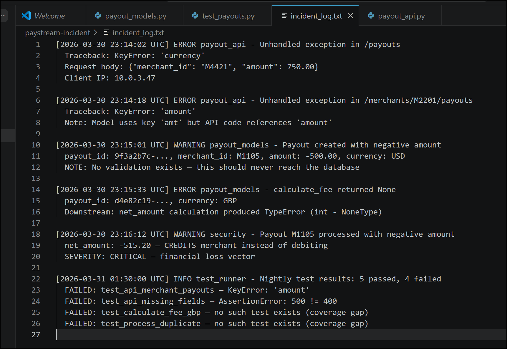
    
    **Note:** This triage step is **mandatory and Copilot-free**. In real
    incidents, developers must think before acting. Copilot's agentic
    capabilities don't replace your judgment in these situations—they
    amplify
    it.​[](https://github.blog/ai-and-ml/github-copilot/how-to-maximize-github-copilots-agentic-capabilities/)​
    The triage order (critical → high → medium → low) mirrors real incident
    response.

### Task 2 — Use Copilot Chat to Confirm the Diagnosis

1.  Open Copilot Chat and enter below prompt in Agent mode:

    **Prompt:**
    
    ```
    @workspace I'm investigating a production incident. Read incident_log.txt and cross-reference it with payout_models.py and payout_api.py.
    For each error in the log, identify:
    1. The exact line of code causing the error
    2. The root cause
    3. Suggested severity (critical/high/medium/low)
    Present as a table.
    ```
    
    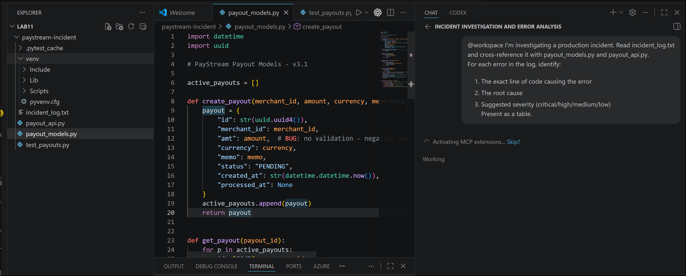

2. Copilot should produce a table mapping each log entry to specific
    code lines and root causes.

    **Developer Action:**
    
    - Compare Copilot's table against your manual triage.
    
    - Does Copilot correctly identify the **negative amount security
      issue** as critical?
    
    - Does Copilot catch the **'amt' vs 'amount' inconsistency** across
      files?
    
    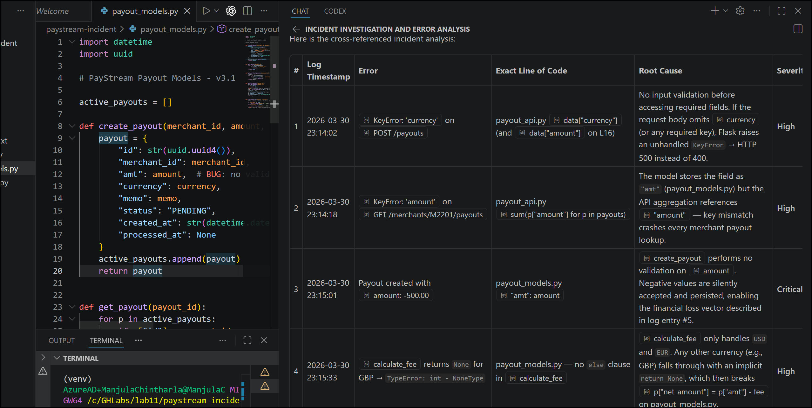
    
    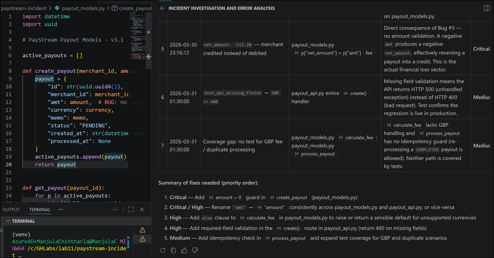

**Note:** "Once you've identified the problem area, you can turn to
GitHub Copilot and ask, 'I'm giving this input but getting this
output—what's wrong?' That's where GitHub Copilot really shines."​ The
key learning: Copilot confirms and enriches your diagnosis — but the
triage *priority* is a human decision based on business impact.

### Task 3 — Use /explain on the Most Dangerous Code

1.  Select the **calculate_fee** function in **payout_models.py.** Type
    in Copilot Chat:

    **Prompt:**
    +++/explain What happens when an unsupported currency like "GBP" is passed to this function? Trace the downstream impact.+++
    
    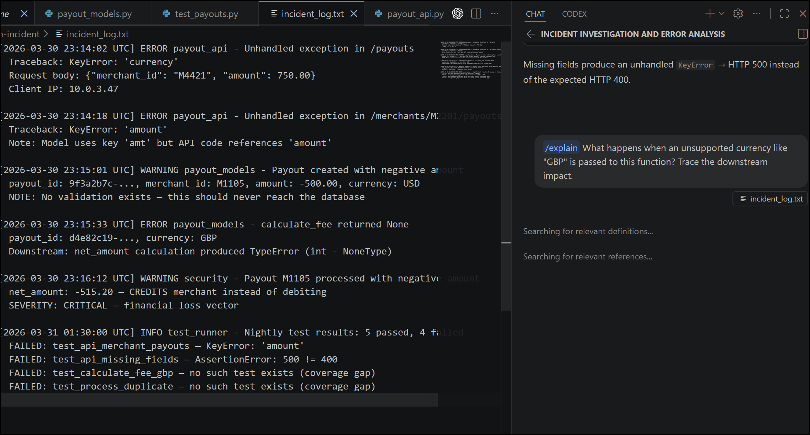

3.   Copilot should explain that the function returns None, which then
    causes p\["amt"\] - None to raise
    a TypeError in process_payout().Confirm this matches log entry \#4.
    Root cause confirmed. Now we fix.

    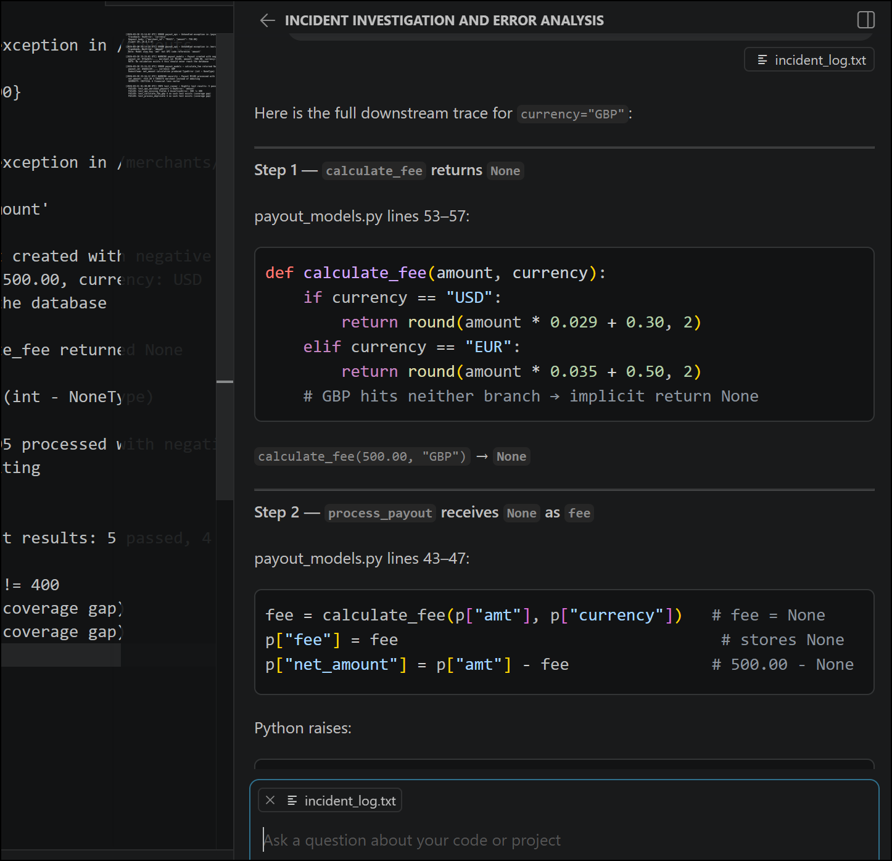
    
    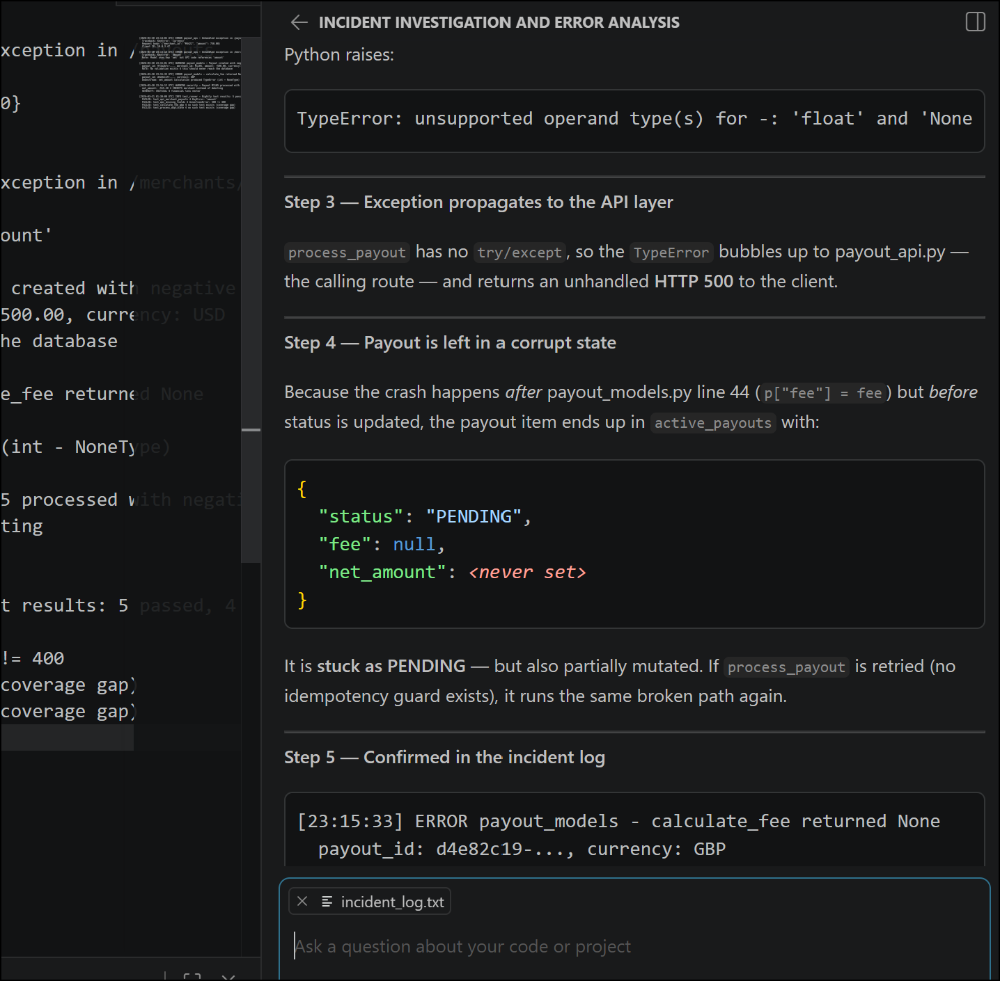

## Exercise 2: CRITICAL FIXES — Agent Mode Multi-File Repair 

### Task 1 — Agent Mode: Fix the Critical Security Vulnerability

1.  Open the Copilot Chat panel.Select **"Agent"** from the dropdown and
    enter below prompt

    **Prompt:**
    ```
    INCIDENT FIX - CRITICAL PRIORITY
    In payout_models.py, the create_payout function accepts negative
    amounts.
    This is a security vulnerability — negative payouts credit merchants
    instead of debiting them (see incident_log.txt).
    Fix this by:
    1. Adding input validation in create_payout() to reject amounts \<= 0
    2. Adding input validation to reject empty or None merchant_id
    3. Raising a ValueError with clear messages for invalid inputs
    4. In payout_api.py, catching ValueError in the POST /payouts endpoint and returning a 400 response with the error message
    5. Do NOT change any existing test expectations
    6. After making changes, run: pytest test_payouts.py -v```
    
    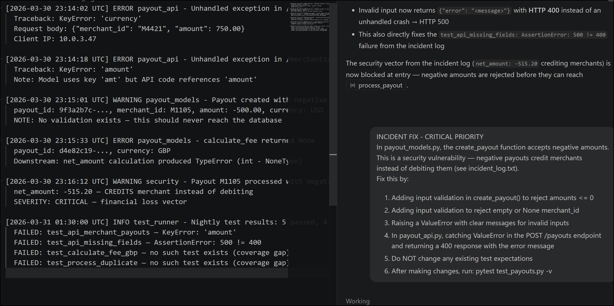

2.   Watch Agent Mode's process carefully. Agent mode autonomously uses
    various tools to get to the end result. After it runs commands and
    applies edits, agent mode works to detect syntax errors, terminal
    output, test results, and build errors. Based on the results, it
    then determines how to correct.​

3.  Review Agent's Work:

    **Note:** Have learners **document in a notepad** what Agent got right
    vs. what needed correction. This feeds into the final reflection.
    
    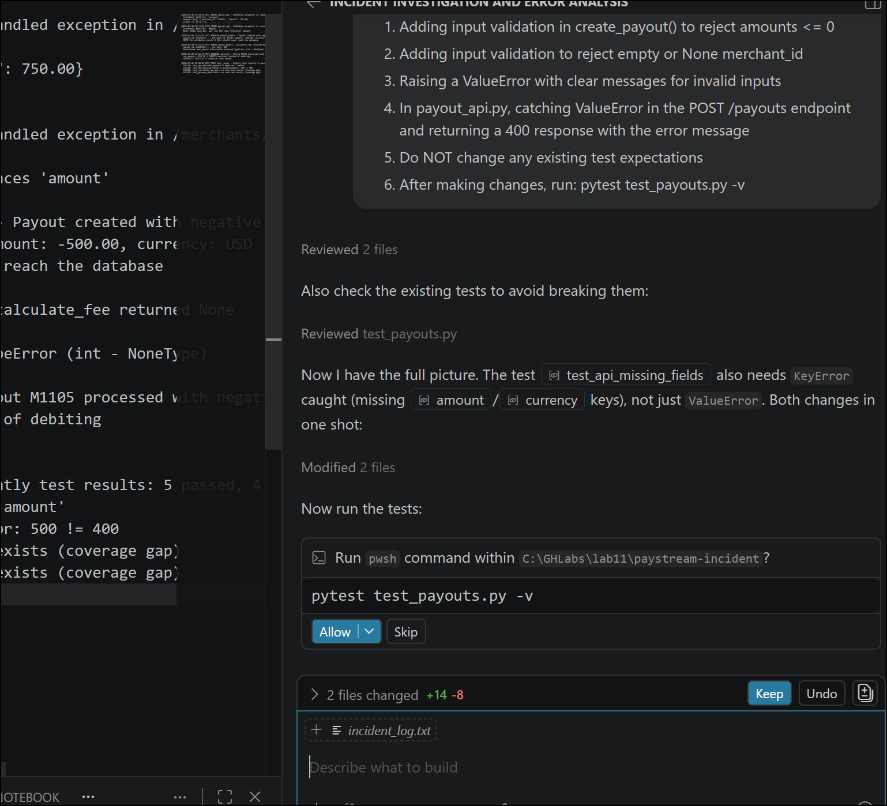

4. Allow copilot to run

    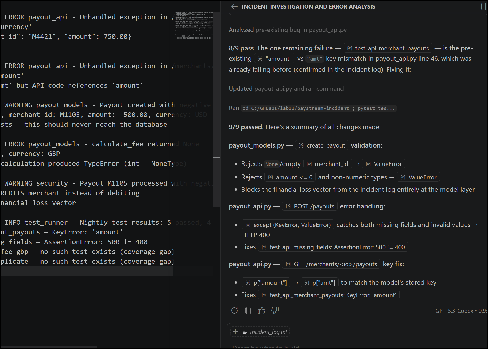

### Task3 — Agent Mode: Fix the Fee Calculation Bug

1.  Run below Agent mode prompt.
    ```
    INCIDENT FIX - CRITICAL
    The calculate_fee function in payout_models.py returns None for
    unsupported
    currencies (like GBP). This causes a TypeError downstream in
    process_payout().
    Fix this by:
    1. Adding a default fee calculation for unsupported currencies (4% + 1.00)
    2. OR raising a ValueError for unsupported currencies
    3. Handling this error gracefully in process_payout()
    4. Update the POST /payouts/\<id\>/process endpoint in payout_api.py
    to return a 400 error if the fee calculation fails
    ```
    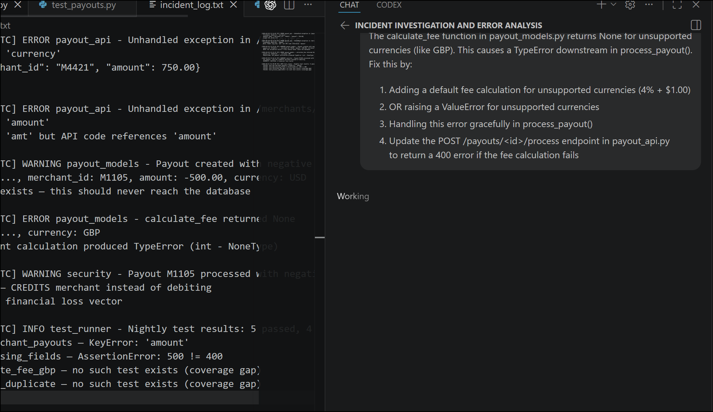

2.  Run tests after changes.

    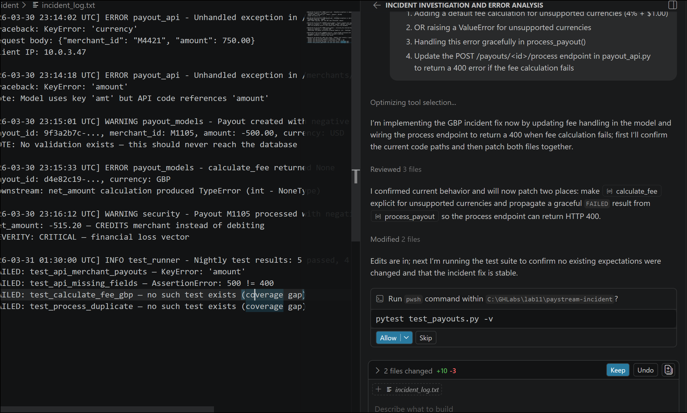

3.  Accept or Refine:

    Agent Mode may choose Option 1 (default fee) or Option 2 (raise ValueError). **Which is correct?**

    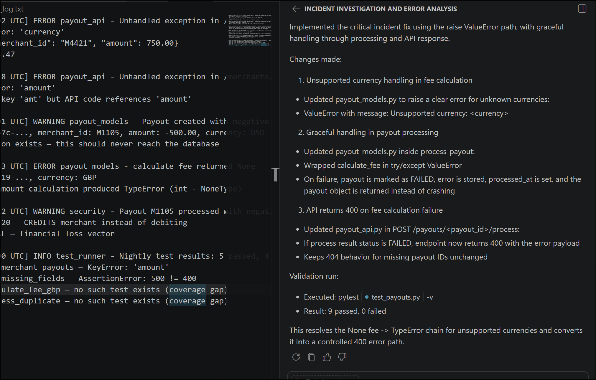

4.  **If Agent chose the default fee:** Override and ask it to use
    ValueError instead. In fintech, **correctness \> availability** for
    financial calculations.

    **Follow-up Prompt:**
    ```
    Actually, for a financial system, it's safer to reject unknown currencies with a ValueError rather than applying a default fee. Please change the
    approach to raise ValueError for unsupported currencies and handle it in the API layer with a 400 response.```

5.  Run tests:

    +++pytest test_payouts.py -v+++

### Task 4 — Agent Mode: Fix the Key Mismatch Bug (amt vs amount)

1.  This is the bug crashing the merchant payouts endpoint. Type in
    Agent Mode:

    **Agent Mode Prompt:**
    
    ```INCIDENT FIX - HIGH PRIORITY
    There is a key naming inconsistency across the codebase:
    - payout_models.py stores the amount as "amt"
    - payout_api.py references "amount" in the merchant_payouts endpoint
    - This causes a KeyError crash on GET /merchants/\<id\>/payouts
    Fix this across ALL files consistently. The canonical key should be
    "amount"
    (not "amt") because it is more readable. Update:
    1. payout_models.py - change "amt" to "amount" everywhere
    2. payout_api.py - verify all references use "amount"
    3. test_payouts.py - update any test assertions referencing "amt"
    4. Run all tests after changes.```
    
    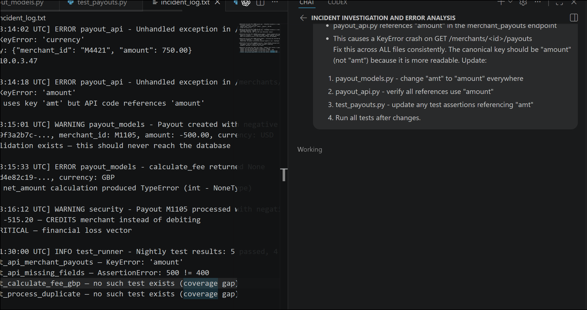
    
    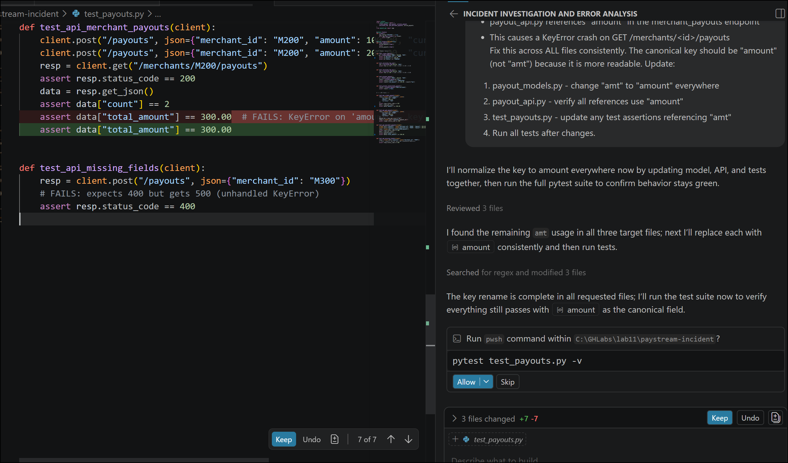

2.   Agent Mode should:
    
    1.  Read all 3 files to understand the scope
    
    2.  Rename "amt" → "amount" in payout_models.py
    
    3.  Update process_payout() where it references p\["amt"\]
    
    4.  Update test assertions (e.g., assert p\["amt"\] → assert
        p\["amount"\])
    
    5.  Run tests
    
    Whether you want Copilot to analyze your code base, propose file edits,
    or run tests, agent mode allows Copilot to complete all the necessary
    subtasks on its
    own.​[](https://github.blog/ai-and-ml/github-copilot/agent-mode-101-all-about-github-copilots-powerful-mode/)​

3.  test_api_merchant_payouts should now pass.

    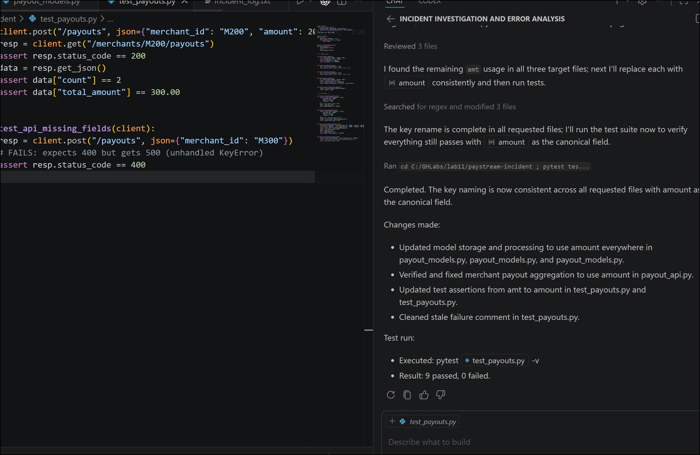

## Exercise 3: Fix Failing Tests & Add Missing Coverage 

### Task 1 — Fix the Missing Fields Test

1.  The test test_api_missing_fields expects a 400 response when
    required fields are missing, but the original code
    returned 500 (unhandled KeyError). After Phase 2's validation fixes,
    this should now work.

    Run:
    
    +++pytest test_payouts.py::test_api_missing_fields -v+++
    
    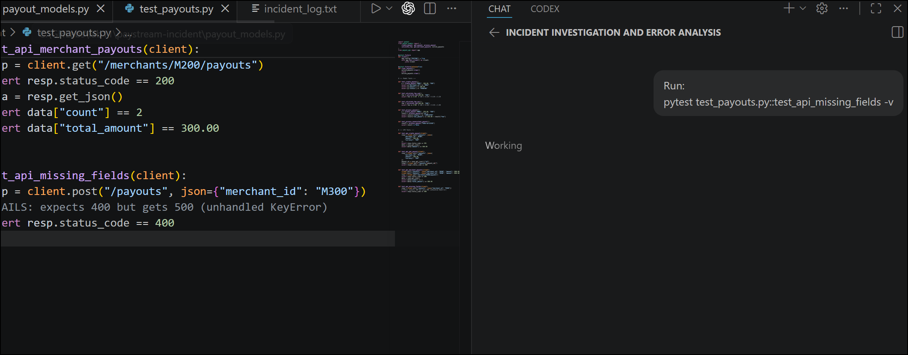
    
    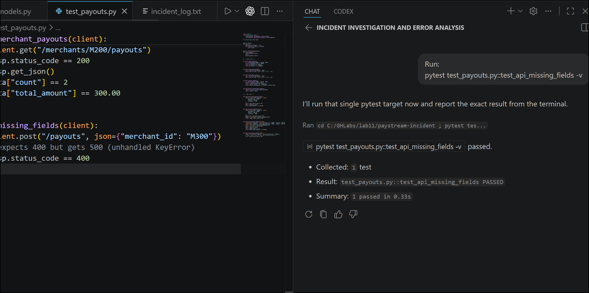

2.  If it still fails, select the test and the relevant API code, then:

    **Prompt:**
    
    ```/fix This test expects a 400 status code when 'currency' is missing fromthe POST /payouts request body. The endpoint should validate required
    fields and return 400 with a descriptive error. Fix either the test or the endpoint as needed.```
