# **Lab 11: Building an Agentic SRE System with GitHub, Dependabot & Feedback Loops**

In this lab, you simulate a real-world Site Reliability Engineering
(SRE) scenario where production systems require continuous monitoring,
rapid incident response, and ongoing improvement. Using GitHub, you
build an **Agentic SRE System** that automates incident detection,
enriches issues with AI-driven insights, manages dependency updates
through Dependabot, and creates a feedback loop for continuous
improvement. This lab demonstrates how modern DevOps practices can
reduce manual effort and improve system reliability through intelligent
automation.

### **Objectives**

By the end of this lab, you will:

- Build a monitoring agent using GitHub Actions

- Automatically detect incidents and create issues

- Enrich incidents with AI-based root cause analysis

- Configure Dependabot for automated dependency updates

- Implement an intelligent workflow to analyze pull requests

&nbsp;

- Create a feedback loop to convert incidents into prevention tasks

- Simulate a complete end-to-end SRE automation pipeline

### **Exercise 1: Set up your GitHub Repository** 

1.  Login to GitHub - <https://github.com/>

2.  On the GitHub home page, click on the **+** icon and select **New
    repository** from the dropdown.

3.  Enter the name of the repository as **sre-agent-lab** and make sure
    **repository visibility** is selected as **Public**.

4.  Click on **Create repository**.

### **Exercise 2: Build a Production Monitoring Agent** 

You are building an **automated monitoring system inside GitHub** that:

- Simulates production health (error rate)

- Detects failures automatically

- Creates incidents **without human intervention**

In real life, this replaces manual monitoring dashboards.

1.  Once the repository is created, select **create a new file** from
    the **Add file** dropdown.

2.  In the filename box, type:

**.github/workflows/sre-monitor.yml**

This automatically creates a **.github** folder, **workflows** inside it
and a file **sre-monitor.yml**

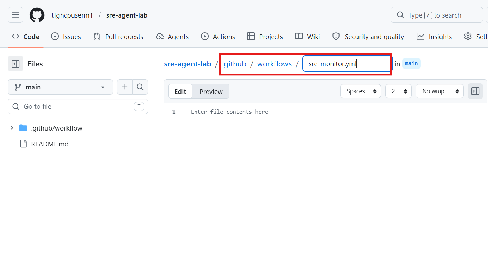

3.  Paste this code in the file content to **add Monitoring Agent
    workflow** and **add Incident Detection Logic:**

name: SRE Monitoring Agent

on:

schedule:

- cron: '\*/5 \* \* \* \*'

workflow_dispatch:

jobs:

monitor:

runs-on: ubuntu-latest

permissions:

issues: write

contents: read

steps:

- name: Simulate system metrics

id: metrics

run: |

ERROR_RATE=15

echo "Error Rate is $ERROR_RATE"

echo "error_rate=$ERROR_RATE" \>\> $GITHUB_OUTPUT

- name: Detect Incident + AI Analysis

if: steps.metrics.outputs.error_rate \> 10

uses: actions/github-script@v7

with:

script: |

const errorRate = '${{ steps.metrics.outputs.error_rate }}';

const timestamp = new Date().toISOString();

// Create issue

const issue = await github.rest.issues.create({

owner: context.repo.owner,

repo: context.repo.repo,

title: \`\[INCIDENT\] High error rate detected: ${errorRate}\`,

body: \`Error rate exceeded threshold.\n\nDetected at: ${timestamp}\`,

labels: \['incident', 'sre', 'automated'\]

});

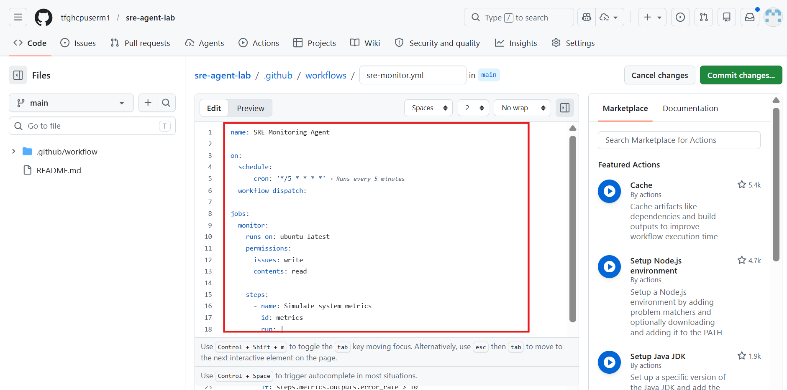

4.  **Commit** the changes.

5.  Add a commit message as **Add SRE Monitoring Agent** and select
    **Commit directly to main.**

6.  Once changes are committed, navigate to **Actions** tab and select
    **SRE Monitoring Agent** from the left pane.

7.  Now, trigger the workflow manually by clicking on the **Run
    workflow** button.

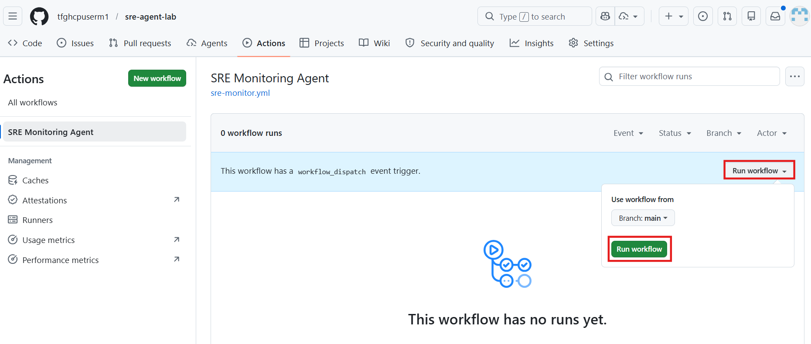

8.  Review the status.

9.  **Expected Outcome:**

- Workflow runs every 5 minutes

- If error rate \> 10, then GitHub issue created automatically.

10. The issue is automatically created by GitHub Actions when the system
    detects a high error rate.

Our workflow continuously monitors system health, and if the error rate
crosses a defined threshold **(\>10)**, it treats it as an incident.  
Instead of manual reporting, the system automatically logs the issue to
ensure quick response and tracking.

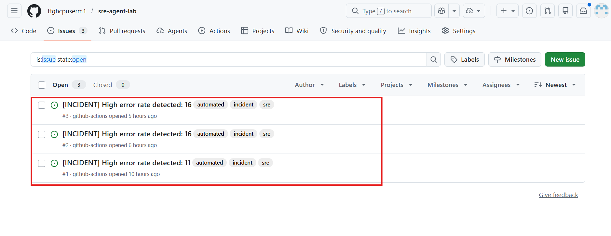

### **Exercise 3: Add AI-Powered Incident Analysis**

1.  Go to **Code** tab again and **edit** the **sre-monitor.yml** file.

2.  **Extend** the workflow with **AI analysis**.

// Add AI comment

const analysis = \`### AI Analysis

- Possible cause: Memory leak or recent deployment issue

- Immediate action: Restart service

- Investigation: Check logs and recent commits

- Prevention: Add monitoring and alerts

\`;

await github.rest.issues.createComment({

owner: context.repo.owner,

repo: context.repo.repo,

issue_number: issue.data.number,

body: analysis

});

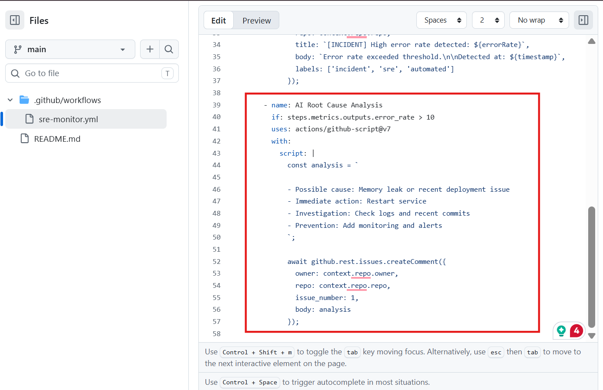

3.  **Commit** the changes.

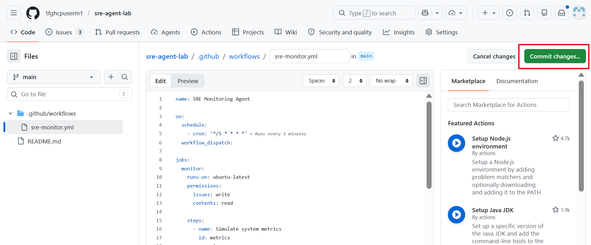

4.  Add the commit message as **Add Detect Incident** and commit the
    changes.

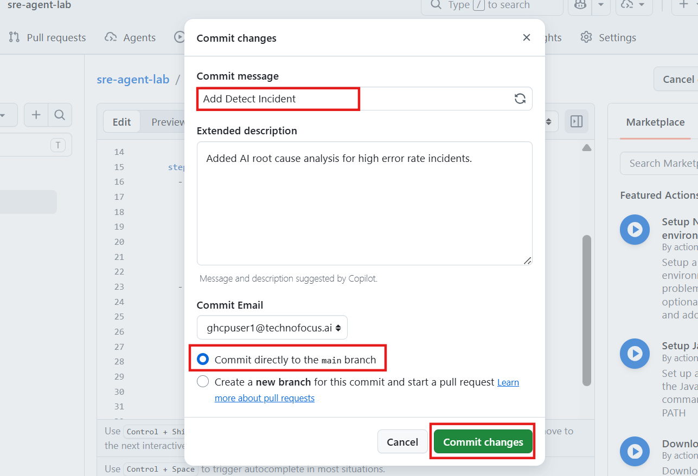

5.  Go to **Actions** tab and select **SRE Monitoring Agent** from the
    left pane. Select **Run workflow.**

6.  Once you run the workflow, navigate to **Issues** tab (wait for
    20-30 seconds) and you’ll see a new issue named ‘**High error rate
    detected: 15**’.

7.  Once an incident is detected, the system not only creates an issue
    but also automatically adds AI-generated analysis to help engineers
    quickly understand and resolve the problem.

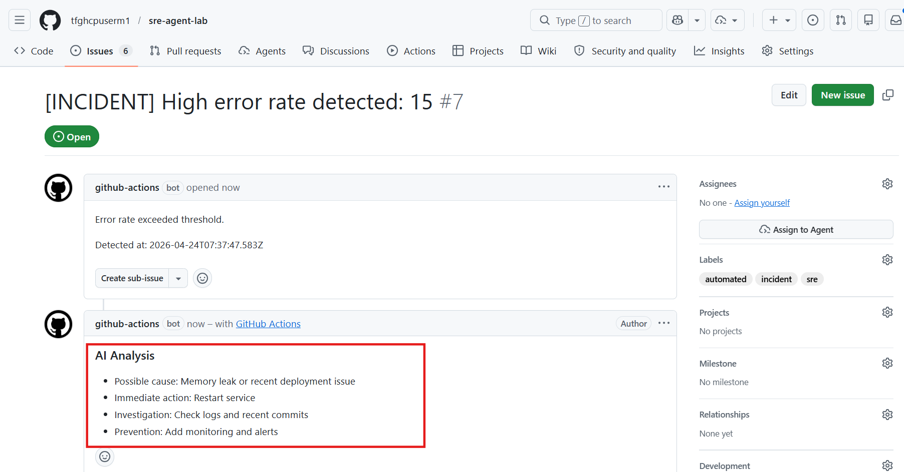

### **Exercise 4: Configure Dependabot as a Modernization Agent**

#### **Task 1: Create Dependabot Config**

1.  Before moving forward, you need to create dependencies as Dependabot
    ONLY works if dependencies exist. On the Code tab, Click on **Add
    file** **\> Create a new file**.

2.  Name the file – **package.json** and enter the below code in it.
    Once done, **commit** the changes.

3.  Enter the commit message as ‘**Add dependency’** and Commit the
    changes.

4.  On the **Code** tab, open **.github/workflows** folder.

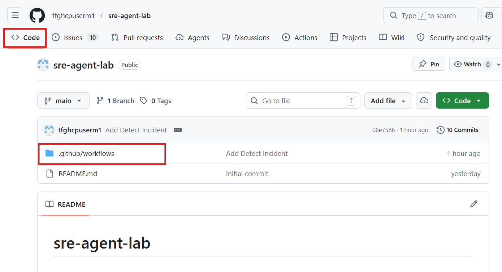

5.  Click on **.github** folder to change the directory as you will be
    creating a new file in .github folder in the next step.

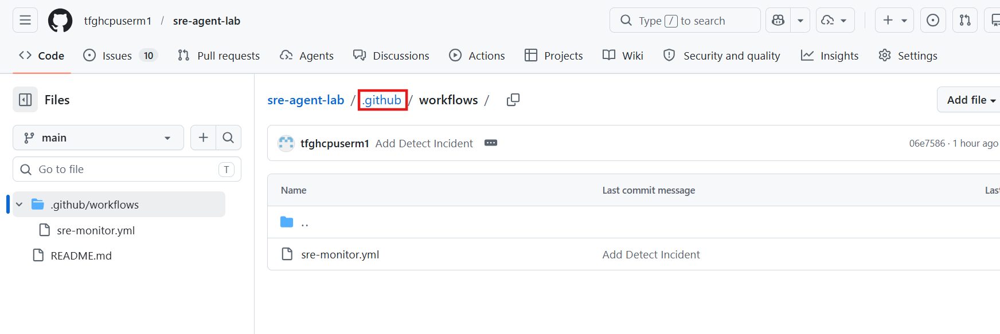

6.  In the **.github** folder, select Add file dropdown and **Create a
    new file**.

7.  Enter the file name as **dependabot.yml**

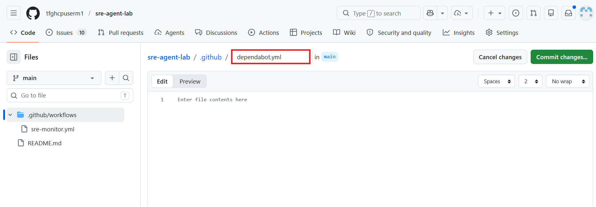

8.  **Paste** the below YAML code in the file and **commit** the
    changes:

version: 2

updates:

- package-ecosystem: npm

directory: "/"

schedule:

interval: daily

This configuration tells **Dependabot** to monitor your project’s npm
dependencies in the root directory. It automatically checks for updates
every week and creates pull requests to keep your dependencies secure
and up to date.

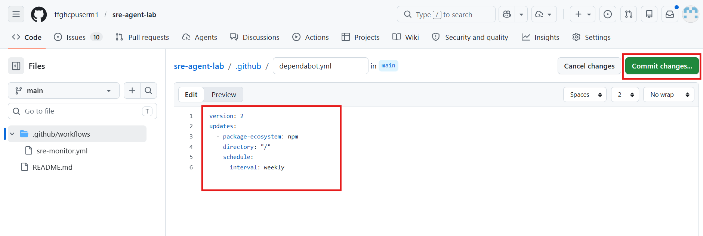

9.  Add a **commit message** as **Add Dependabot Config** and commit the
    changes.

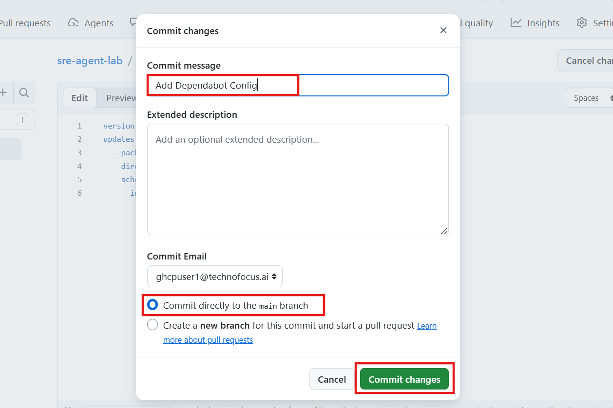

10. Navigate to **Pull requests** tab and you’ll see a new Dependabot
    pull request is automatically created. Inside the PR:

- Files updated (like package.json)

- Version change highlighted

- Security / version info (sometimes)  
    
  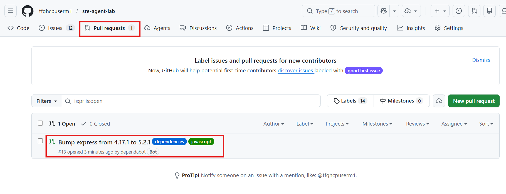

#### **Task 2: Enhance Dependabot with Intelligence**

11. Before moving forward with this task, you need to enable the
    permissions to allow workflows to write in pull requests. Otherwise,
    the workflow will be skipped.

12. Go to your repository **Settings** **\> Actions \> General.**

13. Scroll down to **Workflow permissions** and change to **Read and
    write permissions** and enable – **Allow GitHub Actions to create
    and approve pull requests.**

**Click on Save.**

14. Navigate to **Code** tab and create a **new file** as:

**.github/workflows/dependabot-agent.yml**

15. Paste the below code in the new file to ass automation to analyse
    PRs:

name: Dependabot Intelligence Agent

permissions:

contents: read

pull-requests: write

issues: write

on:

pull_request_target:

types: \[opened, synchronize, reopened\]

jobs:

analyze:

runs-on: ubuntu-latest

steps:

- uses: dependabot/fetch-metadata@v2

id: meta

- name: Add Analysis Comment

uses: actions/github-script@v7

with:

script: |

const pkg = '${{ steps.meta.outputs.dependency-names }}';

await github.rest.issues.createComment({

owner: context.repo.owner,

repo: context.repo.repo,

issue_number: context.payload.pull_request.number,

body: \`## 🤖 Dependabot Analysis\n\nPackage: ${pkg}\n\nReview required
before merge.\`

});

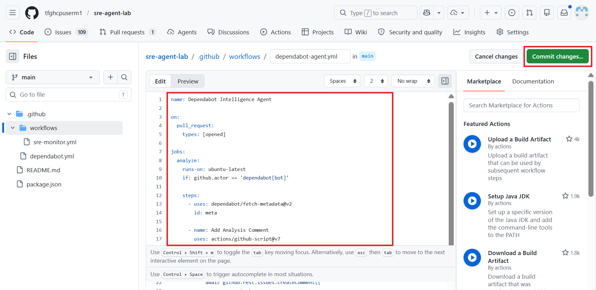

16. Add a commit message as ‘**Add Dependabot intelligence agent’** and
    commit the changes.

17. Navigate to **Actions** tab and select **Dependabot Intelligence
    Agent** from the left pane and make sure the workflow is successful.

18. Now, go to **Pull request** tab and open the pull request that was
    created in the previous task.

19. Whenever Dependabot creates a pull request, our workflow
    automatically analyzes it and adds **context-aware comments**,
    helping developers understand the impact before merging. You’ll see
    something like:

🤖 Dependabot Analysis

Package: express

Review required before merge.

### **Exercise 5: Build SRE Feedback Loop**

**Goal:** Convert a resolved incident into prevention tasks
automatically**.**

1.  Navigate to **Code** tab again and create **a new file**:

**.github/workflows/sre-feedback.yml**

2.  Paste the below code in the new file and **commit** the changes:

name: Incident Feedback Loop

on:

issues:

types: \[labeled\]

jobs:

feedback:

runs-on: ubuntu-latest

if: github.event.label.name == 'resolved'

steps:

- uses: actions/github-script@v7

with:

script: |

const issue = context.payload.issue;

if (!issue.labels.some(l =\> l.name === 'incident')) return;

const tasks = \[

"Add monitoring for this failure",

"Improve logging for root cause detection",

"Add automated test for failure scenario"

\];

for (const task of tasks) {

await github.rest.issues.create({

owner: context.repo.owner,

repo: context.repo.repo,

title: \`\[Prevention\] ${task}\`,

body: \`Generated from incident \#${issue.number}\`,

labels: \['prevention'\]

});

}

3.  Add a **commit message - ‘Add Incident Feedback Loop’** and commit
    the changes.

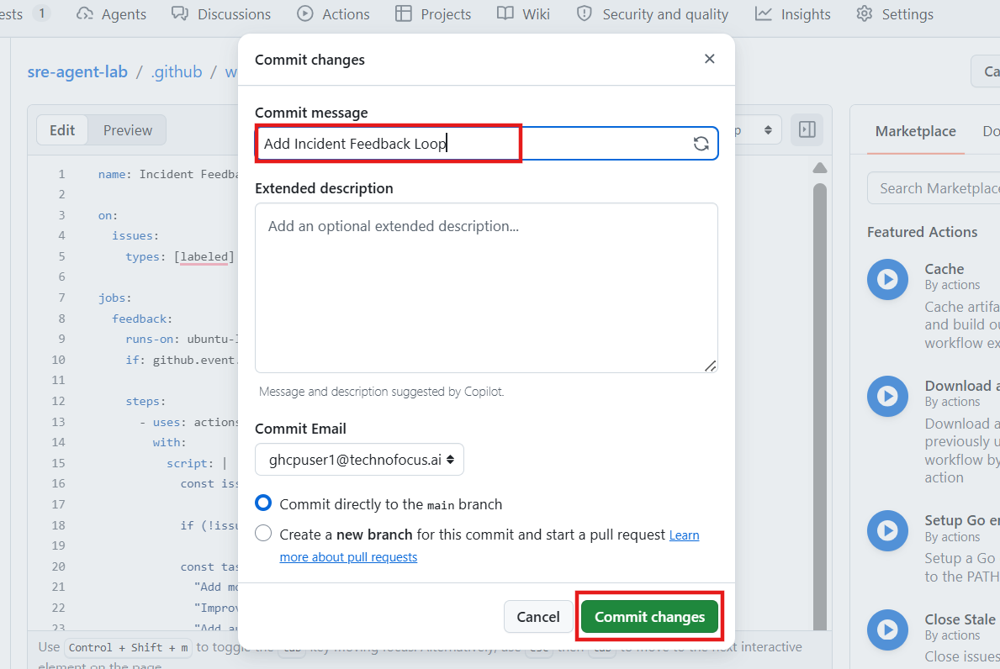

4.  Go to **Actions** tab and select **SRE Monitoring Agent** from the
    left pane and **Run** the workflow.

5.  Make sure the workflow run is successful.

6.  Go to **Issues** tab and you should see a new issue created as
    **\[INCIDENT\] High error rate detected.**

7.  Select the **Labels** **settings** icon on the right side.

8.  Write **Resolved** in the search bar and select **create a new label
    as Resolved**.

Make sure Resolved label is added to the issue.

9.  What happens immediately after adding the **Resolved** label:  
      
    This triggers your workflow: **(Note: This you have added in
    sre-feedback.yml file)**

on:

issues:

types: \[labeled\]

And condition:

if: github.event.label.name == 'resolved'

10. Select the **Issues** tab again and you will now see NEW Issues
    created automatically like:

> \[Prevention\] Add monitoring for this failure
>
> \[Prevention\] Improve logging for root cause detection
>
> \[Prevention\] Add automated test for failure scenario
>
> **Note:** When an incident is marked as resolved, the system
> automatically creates follow-up tasks like improving monitoring,
> logging, and testing. This ensures every failure leads to
> improvements, forming a continuous feedback loop that prevents similar
> issues in the future.
>
> 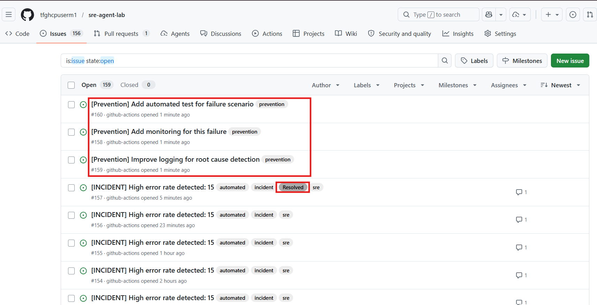

### **Conclusion**

In this lab, you successfully built a complete Agentic SRE system that
integrates monitoring, incident management, automation, and continuous
improvement. By leveraging GitHub workflows and Dependabot, you
automated the detection of failures, enhanced incident response with AI
insights, and ensured long-term reliability through feedback-driven
improvements. This approach reflects modern SRE practices where systems
are not only reactive but also proactive and self-improving, reducing
operational overhead and increasing overall system resilience.

[TABLE]
