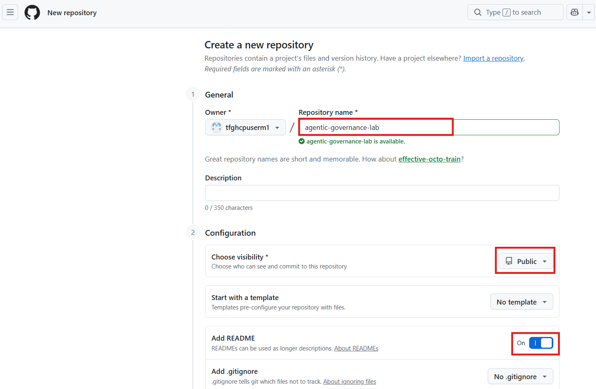
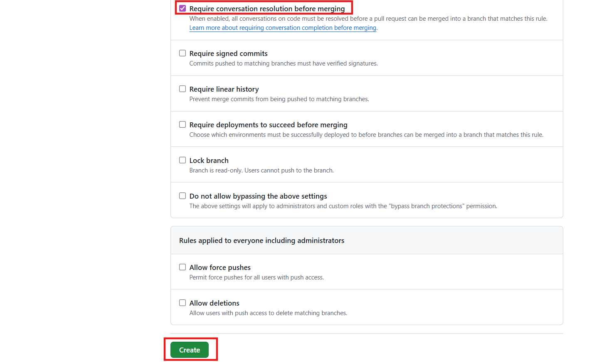
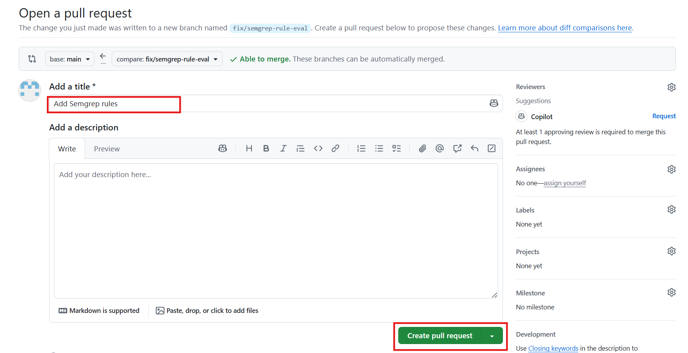
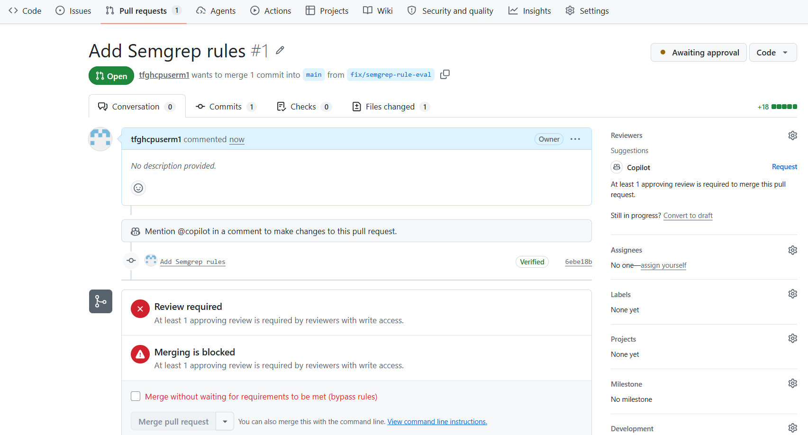

# **Lab 13: Automating Code Security: Blocking eval() with GitHub Actions and Semgrep**

As a developer on the Octomatch team, you have already established a
robust testing setup that generates valuable reports for your
application.

### **Objectives**

- Create and configure GitHub Actions workflows

- Upload workflow artifacts such as test coverage reports

### **Exercise 1: Create the repository and baseline app**

1.  Sign in to your **[Github](https://github.com/)** account.

2.  Click on the **+** icon and create **a new repository**.

3.  Set the repository name as **agentic-governance-lab**. Make sure
    repository is set to **Public** and add a **README** file. Click on
    **Create repository**.

4.  Once the repository is created, **create a new file** from the **Add
    file** dropdown.

5.  Enter the file name as **index.js** and enter the below **code**.
    Once done, **commit** the changes.

> // Simple Node HTTP app used by the lab
>
> const http = require('http');
>
> const server = http.createServer((req, res) =\> {
>
> if (req.url === '/health') {
>
> res.writeHead(200, { 'Content-Type': 'application/json' });
>
> res.end(JSON.stringify({ status: 'ok' }));
>
> return;
>
> }
>
> res.writeHead(200, { 'Content-Type': 'text/plain' });
>
> res.end('Hello agentic governance lab');
>
> });
>
> if (require.main === module) {
>
> const port = process.env.PORT || 3000;
>
> server.listen(port, () =\> {
>
> console.log(\`Server listening on port ${port}\`);
>
> });
>
> }
>
> module.exports = server;

6.  Keep the copilot’s suggested commit message and **commit** changes
    directly to **main**.

7.  Navigate to **Code** tab and create **a new file**.

8.  Enter the file name as **package.json** and paste the below code
    into the file. Once done, **commit** the changes.

> {
>
> "name": "agentic-governance-lab",
>
> "version": "0.1.0",
>
> "private": true,
>
> "scripts": {
>
> "start": "node index.js",
>
> "test": "node test.js"
>
> },
>
> "dependencies": {},
>
> "devDependencies": {}
>
> }
>
> 

9.  Add the **commit message** and **commit** changes directly to the
    main branch.

### **Exercise 2: Enable branch protection and push restrictions**

1.  Navigate to the **Settings** tab and select Branches from the

### **Exercise 3: Add Semgrep for pattern detection**

1.  Navigate to the Code tab. Click **Add file** (green button) then
    **Create new file**.

> 

2.  In the **Name your file** box type .semgrep.yml.

3.  Paste the Semgrep YAML content into the editor:

> rules:
>
> - id: no-eval
>
> patterns:
>
> - pattern: eval(...)
>
> message: "Avoid eval() — dynamic code execution is risky."
>
> severity: ERROR
>
> - id: child-process-exec
>
> patterns:
>
> - pattern: child_process.exec(...)
>
> message: "Avoid child_process.exec; prefer spawn with sanitized
> inputs."
>
> severity: WARNING
>
> - id: large-generated-block
>
> patterns:
>
> - pattern-regex: '/\\\* GENERATED BY AI START \\\*/(.|\\n){200,}/\\\*
> GENERATED BY AI END \\\*/'
>
> message: "Large AI-generated block detected; require human review."
>
> severity: WARNING
>
> 

4.  Scroll down to **Commit new file**. Enter a commit message like
    **Add Semgrep rules**.

5.  Choose **Commit directly to the main branch** (or create a new
    branch and open a PR).

6.  Click **Commit new file**.

> 
>
> 
>
> 

#### **Task 1: Create the Semgrep GitHub Action workflow via the web UI**

1.  From the repo root, click **Add file → Create new file**.

> 

2.  In the filename box type **.github/workflows/semgrep.yml**

> 

3.  Paste the workflow content:

> name: Semgrep Scan
>
> on:
>
> pull_request:
>
> types: \[opened, synchronize, reopened\]
>
> jobs:
>
> semgrep:
>
> runs-on: ubuntu-latest
>
> steps:
>
> - uses: actions/checkout@v4
>
> - name: Setup Python
>
> uses: actions/setup-python@v4
>
> with:
>
> python-version: '3.x'
>
> - name: Install semgrep
>
> run: pip install semgrep
>
> - name: Run semgrep
>
> run: semgrep --config .semgrep.yml --json --output
> semgrep-results.json
>
> - name: Upload results
>
> uses: actions/upload-artifact@v4
>
> with:
>
> name: semgrep-results
>
> path: semgrep-results.json
>
> - name: Fail on errors
>
> run: |
>
> if \[ ! -f semgrep-results.json \]; then echo "No results file"; exit
> 0; fi
>
> COUNT=$(jq '.results | length' semgrep-results.json)
>
> if \[ "$COUNT" -gt 0 \]; then
>
> echo "Semgrep found issues:"
>
> jq -r '.results\[\] | "- " + .check_id + " " + .path + ":" +
> (.start.line|tostring) + " - " + .extra.message' semgrep-results.json
>
> exit 1
>
> fi
>
> 

4.  Commit the file with message **Add Semgrep workflow** and commit to
    main or open a PR.

> 
>
> 
>
> 
>
> 

#### **Task 2: Triggering and Observing Semgrep on a Pull Request**

This step shows students how insecure code (like eval()) is
automatically detected by the Semgrep workflow. They learn how CI checks
block unsafe merges.

1.  In your repo, click the **Code** tab.

2.  Switch to **test/semgrep-workflow** branch.

> 

3.  In that branch, click **Add file → Create new file**.

> 

4.  Name it bad.js and paste:

> eval("console.log('unsafe')");

5.  Scroll down → in Commit changes, choose Commit directly to the test
    branch.

> 
>
> 
>
> 

6.  Wait a few seconds → in the PR page, scroll to Checks. You’ll see
    Semgrep Scan.

> 

7.  Click Details → this opens the Actions run.

> 
>
> 

8.  In the run, click the job semgrep → expand Run semgrep and Fail on
    errors steps.

> 

9.  You’ll see JSON output and the printed findings.

10. Scroll down → under Artifacts, click semgrep-results to download the
    JSON file.

The purpose of adding eval() was to **trigger the Semgrep rule**.

this means Semgrep found something it considers an error and exited with
a non‑zero code (exit code 7). The failure is intentional in this lab:
it demonstrates that risky code (like eval()) blocks the PR from
merging. Branch protection rules will now enforce this — the PR cannot
be merged until the check passes (i.e., you remove or fix the insecure
code).

#### **Task 3: Adding Semgrep as a Required Status Check in Branch Protection**

1.  Go to your repo → click **Settings** (top menu).

2.  In the left sidebar, click **Branches**.

3.  Under **Branch protection rules**, click **Add classic branch
    protection rule**.

4.  In **Branch name pattern**, type main.

> 

5.  Scroll down → check **Require pull request reviews before merging**.

6.  Check **Require status checks to pass before merging**.

7.  A list of available checks appears. Select **Semgrep Scan** (the
    name must match exactly what you saw in Actions).

8.  Scroll down → check **Require branches to be up to date before
    merging** and **Require conversation resolution before merging**.

Note: BY adding this, GitHub blocks merges until Semgrep passes. This
enforces your governance policy — unsafe code (like eval()) cannot be
merged into main. Once you do, any PR with risky code will show a red ❌
and merging will be blocked until the issue is fixed.

> 

9.  Click **Create** or **Save changes**.

> 
