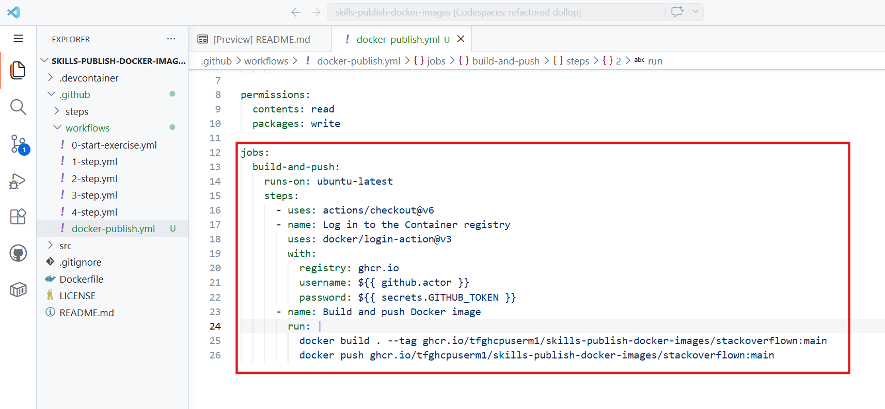
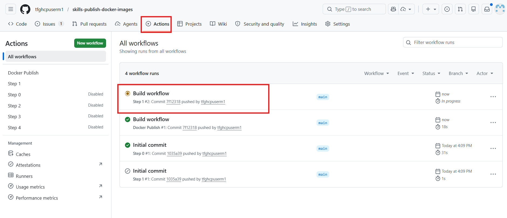
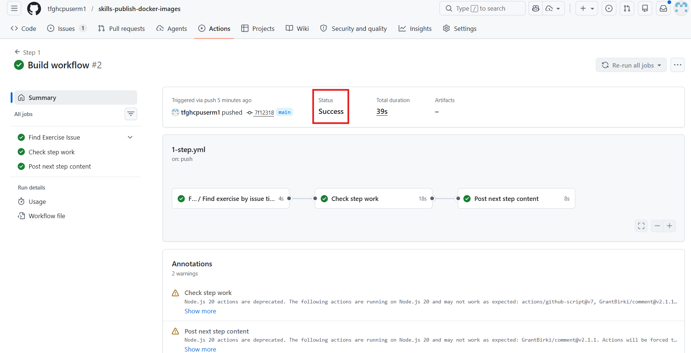
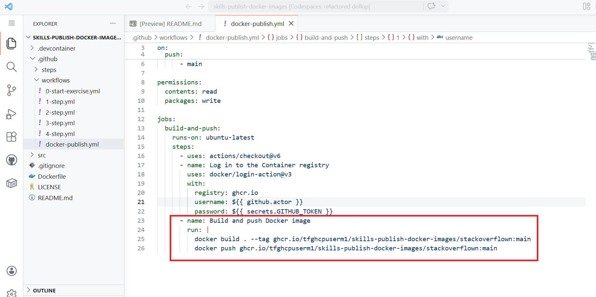
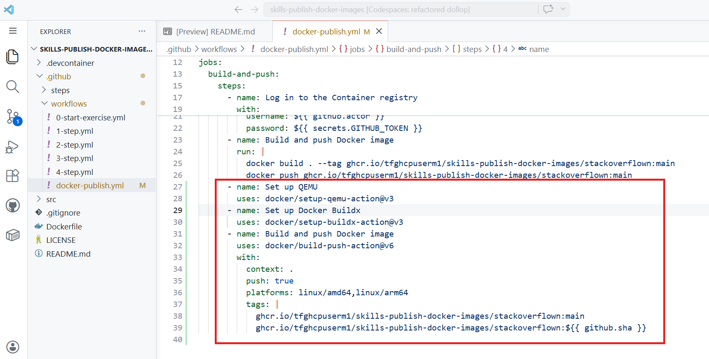
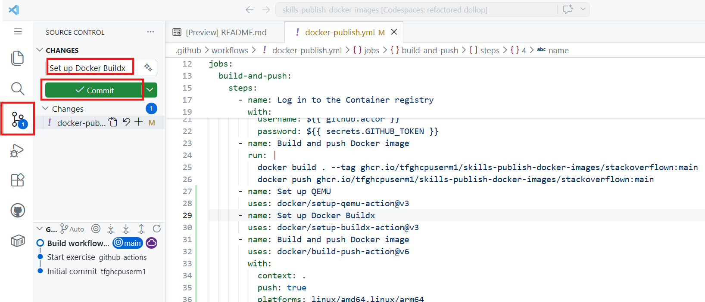
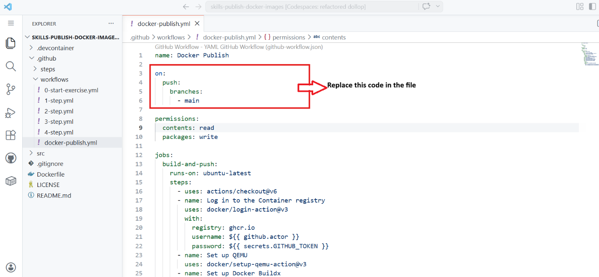

# **Lab 3: Automate Docker Image Publishing with GitHub Actions**

You and your team have been working hard on an awesome web-based game
called **Stackoverflown**. It's a hit, and now you want to **package and
version** it for distribution so players everywhere can easily run it
and deploy it on their servers.

To make this happen efficiently, let's automate the process of packaging
new versions of your app using GitHub Actions! By automating the build
and deployment process, you will enable seamless versioning and
distribution of your application through the GitHub Container Registry.
This hands-on exercise demonstrates how modern DevOps practices simplify
application delivery and ensure consistency across environments.

### **Objectives**

- Set up a development environment using GitHub Codespaces

- Create a GitHub Actions workflow to build and publish Docker images

- Run and test the published Docker image locally

- Enhance workflows using official Docker actions

- Configure multiple triggers and metadata for dynamic image tagging

- Implement a feature using branching and commits

- Create and validate a Pull Request workflow

- Publish a release with version tagging

### **Exercise 1: Set up the development environment**

Let's use **GitHub Codespaces** to set up a cloud-based development
environment and work in it for the remainder of the exercise!

1.  Open the repository in your browser:
    <https://github.com/skills/publish-docker-images> and **Fork** it.

### **Exercise 2: Create Basic Docker Publish Workflow**

Let's start off by creating a workflow to build and publish
our **Stackoverflown** game as a docker image.

1.  In your codespace, within the **.github/workflows** directory.

> 

2.  Create a new workflow file named: **docker-publish.yml**

> 

3.  Within that file, let's start by defining the workflow name, event
    trigger and permissions:

> name: Docker Publish
>
> on:
>
> push:
>
> branches:
>
> \- main
>
> permissions:
>
> contents: read
>
> packages: write
>
> This workflow will run on all commits pushed to the main branch with
> permissions to read the repository contents and push packages to the
> GitHub Container Registry.
>
> 

4.  Add the build-and-push job to the end of the file:

> jobs:
>
> build-and-push:
>
> runs-on: ubuntu-latest
>
> steps:
>
> \- uses: actions/checkout@v6
>
> \- name: Log in to the Container registry
>
> uses: docker/login-action@v3
>
> with:
>
> registry: ghcr.io
>
> username: ${{ github.actor }}
>
> password: ${{ secrets.GITHUB_TOKEN }}
>
> \- name: Build and push Docker image
>
> run: |
>
> docker build . --tag
> ghcr.io/tfghcpuserm1/skills-publish-docker-images/stackoverflown:main
>
> docker push
> ghcr.io/tfghcpuserm1/skills-publish-docker-images/stackoverflown:main
>
> This job checks out the repository code, authenticates to the GitHub
> Container Registry using GITHUB_TOKEN, builds the Docker image, and
> publishes it to the registry under your GitHub account.
>
> **Note**: The docker build follows the instructions in the
> **Dockerfile** file present in the repository on how to package the
> application.
>
> 

5.  Go to **Source Control** tab and add a **commit message** and push
    your changes to the **main** branch.

> 

6.  Click **Yes** to stage all your changes and commit them directly to
    main branch.

> 

7.  **Sync** the committed changes.

> 

8.  Click **OK** to confirm.

> 

9.  When you push your changes, the workflow you just created should
    also run for the first time. Monitor it in the **Actions** tab
    and **ensure it completes successfully**.

> 
>
> 

### **Exercise 3: Pull and run your docker image**

The commit from your previous step should have triggered the first run
of your workflow and published a Docker image to the GitHub Container
Registry.

Let's pull that image and run it in your codespace to see the game
running!

10. Go to your repository’s main page and on the right side, under
    the **Packages** section,
    click **skills-publish-docker-images/stackoverflown**

> 

11. **Copy** the command that starts with **docker pull ...**

> 

12. Back in your **codespace**, open the terminal and run that command
    in the terminal to download the image from the container registry.

> 
>
> 

13. Verify the image is available locally by running:

> docker images
>
> 

14. Let's create a Docker container from that image and see the
    stackoverflown app running! Run the below command in the terminal:

> **docker run -p 8080:80
> ghcr.io/tfghcpuserm1/skills-publish-docker-images/stackoverflown:main**
>
> **Note:** replace your account name in the url and run the command.
>
> 

15. You can access the application through the **Ports tab - on
    port 8080**

> 

16. This will open a new tab in your browser. Review the application.  
      
    

17. You can stop the application from running by hitting **Ctrl +
    C** back in the terminal.

> 

### **Exercise 4: Leverage open source Docker Actions**

Let's edit the workflow to use the official Docker actions for a more
robust and feature-rich build process.

18. Open the **.github/workflows/docker-publish.yml** file.

19. Remove your existing **Build and push Docker image** step
    with docker commands. We will replace that with open source actions.

> Caution:** Only remove the Build and push Docker image step.
> Do **not** remove the steps
> with actions/checkout and docker/login-action actions.**
>
> 

20. Now, add these following three steps in place of the Build and push
    Docker image step you just removed.

> These steps will set up QEMU for multi-architecture builds, set up
> Docker Buildx, and then build and push the Docker image with two
> different tags.
>
> \- name: Set up QEMU
>
> uses: docker/setup-qemu-action@v3
>
> \- name: Set up Docker Buildx
>
> uses: docker/setup-buildx-action@v3
>
> \- name: Build and push Docker image
>
> uses: docker/build-push-action@v6
>
> with:
>
> context: .
>
> push: true
>
> platforms: linux/amd64,linux/arm64
>
> tags: |
>
> ghcr.io/tfghcpuserm1/skills-publish-docker-images/stackoverflown:main
>
> ghcr.io/tfghcpuserm1/skills-publish-docker-images/stackoverflown:${{
> github.sha }}
>
> Ensure the **yaml** indentation is setup correctly!
>
> **Tip:** You can run actionlint command in the terminal to see if the
> workflow is properly formatted.
>
> In case you need it, here is the full content of the updated workflow
> file:
>
> name: Docker Publish
>
> on:
>
> push:
>
> branches:
>
> \- main
>
> permissions:
>
> contents: read
>
> packages: write
>
> jobs:
>
> build-and-push:
>
> runs-on: ubuntu-latest
>
> steps:
>
> \- uses: actions/checkout@v6
>
> \- name: Log in to the Container registry
>
> uses: docker/login-action@v3
>
> with:
>
> registry: ghcr.io
>
> username: ${{ github.actor }}
>
> password: ${{ secrets.GITHUB_TOKEN }}
>
> \- name: Set up QEMU
>
> uses: docker/setup-qemu-action@v3
>
> \- name: Set up Docker Buildx
>
> uses: docker/setup-buildx-action@v3
>
> \- name: Build and push Docker image
>
> uses: docker/build-push-action@v6
>
> with:
>
> context: .
>
> push: true
>
> platforms: linux/amd64,linux/arm64
>
> tags: |
>
> ghcr.io/tfghcpuserm1/skills-publish-docker-images/stackoverflown:main
>
> ghcr.io/tfghcpuserm1/skills-publish-docker-images/stackoverflown:${{
> github.sha }}
>
> 

21. Navigate to **Source Control** and add a **commit message** to push
    your changes to the **main** branch.

> 

22. Monitor your workflow run in the **Actions** tab of your repository
    and **ensure it completes successfully**.

> 
>
> 

### **Exercise 5: Adding additional triggers and metadata action**

Let's update our workflow to support multiple triggers and use the
metadata action for dynamic docker image tagging.

1.  Navigate to the codespace. Edit
    the **.github/workflows/docker-publish.yml** file and update the
    event triggers part of the workflow to include all of the following
    triggers

> on:
>
> push:
>
> branches:
>
> \- main
>
> tags:
>
> \- "v\*"
>
> pull_request:
>
> branches:
>
> \- main
>
> workflow_dispatch:
>
> 
>
> 

2.  Add a step to extract metadata for Docker images

> ❗️ Place it before the docker/build-push-action step.
>
> \- name: Extract metadata for Docker
>
> id: meta
>
> uses: docker/metadata-action@v5
>
> with:
>
> images:
> ghcr.io/tfghcpuserm1/skills-publish-docker-images/stackoverflown
>
> 

3.  Update the docker/build-push-action step to use the generated tags.

> \- name: Build and push Docker image
>
> uses: docker/build-push-action@v5
>
> with:
>
> context: .
>
> push: true
>
> platforms: linux/amd64,linux/arm64
>
> tags: ${{ steps.meta.outputs.tags }}
>
> Ensure the yaml indentation is setup correctly!
>
> 
>
> **Tip: You can run ‘actionlint’ command in the terminal to see if the
> workflow is properly formatted. If it is showing no output, this means
> YAML syntax is correct and workflow file has no syntax or formatting
> errors.**
>
> 

4.  Go to **Source Control** tab and add a **commit message** - ‘**Add
    Docker metadata**’ and **commit** and push your changes to
    the main branch.

> 

5.  Click **Yes** to stage all your changes and commit them directly.

> 

6.  **Sync** the committed changes.

> 

7.  Click **OK** to confirm.

> 

8.  Go to **Actions** tab and review the recent workflow as **Add Docker
    metadata.** Make sure it’s successful.

> 

### **Exercise 6: Add a feature**

Let's start off by adding a simple code change to our source code.

1.  Go to your codespace. Start by switching to a new branch
    called **feature/add-high-score**:

> **git branch feature/add-high-score**
>
> **git checkout feature/add-high-score**
>
> 

2.  Open the **src/index.html** file.

> 

3.  At line 20, replace the **info-section** area about scoring with the
    below example.

> \

>
> \<h3\>Current Score\</h3\>
>
> \
0\</div\>
>
> \<h3\>High Score\</h3\>
>
> \
0\</div\>
>
> \</div\>
>
> This will demonstrate 3 kinds of changes:

- Modify the Score label to Current Score

- Add the High Score information.

- Remove the status information.

> 

4.  Open your terminal and run these command to commit and push your
    changes to the **feature/add-high-score** branch:

> **git add src/index.html**
>
> **(This will stage the file for the next commit)**
>
> 
>
> **git commit -m "Add high score display"**
>
> **(It creates a commit with the changes you previously staged)**
>
> 
>
> **git push -u origin feature/add-high-score**
>
> **(It pushes your local branch to GitHub and sets it as the default
> upstream branch)**
>
> 

### **Exercise 7: Create a pull request**

Now that you have your feature branch ready, let's create a Pull Request
to see if your workflow builds the image with the appropriate pr-X tag.

1.  In a new browser tab, navigate to the **Pull Requests** tab of your
    repository.

> 

2.  Create a Pull Request targeting main branch from the branch you just
    created.

**Wait: Don't merge it yet!**

> 

3.  Go to the **Actions** tab and watch the Docker Publish workflow run
    triggered by the Pull Request.

    - This run will build the image with the pr-X tag (e.g., pr-2).

> 
>
> 

4.  Once the workflow finishes successfully verify the image is present
    in the **Packages** section of your repository on the **Code** tab.

> 
>
> 

5.  You can pull and run the image in your codespace to see the changes
    in action before merging!

> Replace \<PR_NUMBER\> with your actual Pull Request number:
>
> **docker run -d -p 8080:80
> ghcr.io/tfghcpuserm1/skills-publish-docker-images/stackoverflown:pr-\<PR_NUMBER\>**
>
> 
>
> You can access the application through the **Ports tab - on
> port 8080.** 
>
> 

6.  See the new high score feature!

> 

### **Exercise 8: Merge the pull request and create a release**

Alright! Now let's merge the pull request and create a stable release
with a proper version tag.

1.  Go back to the **Pull Request** and **merge** it into main.

> **Note: This will also trigger a new Docker Publish workflow run**
>
> 

2.  **Confirm** the merge.

> 

3.  Go to the **Code** tab of your repository and click on **Create a
    new** **release** (on the right sidebar).

> 

4.  Enter the details for a new release:

- Choose a tag: **v1.0.0** (Create new tag)

> 
>
> 

- Target: **main**

> 

- **Release Title**: v1.0.0

> 

- **Release notes:** First official release with high score tracking!

> 

5.  At the bottom, click the **Publish release** button.

> 
>
> 

6.  Go to the **Actions** tab one last time. You should see a workflow
    run triggered by the new tag.

    - This run will build the image with the v1.0.0 tag.

> 
>
> 

7.  Once the workflow finishes successfully verify the
    image v1.0.0 image is present in the **Packages** section of your
    repository.

> 
>
> 

### **Conclusion**

In this lab, you successfully automated the process of building,
tagging, and publishing Docker images using GitHub Actions. You also
practiced branching, pull requests, and release management to simulate a
real-world development workflow. This end-to-end experience highlights
how CI/CD pipelines improve efficiency, maintain consistency, and
support scalable application deployment.
