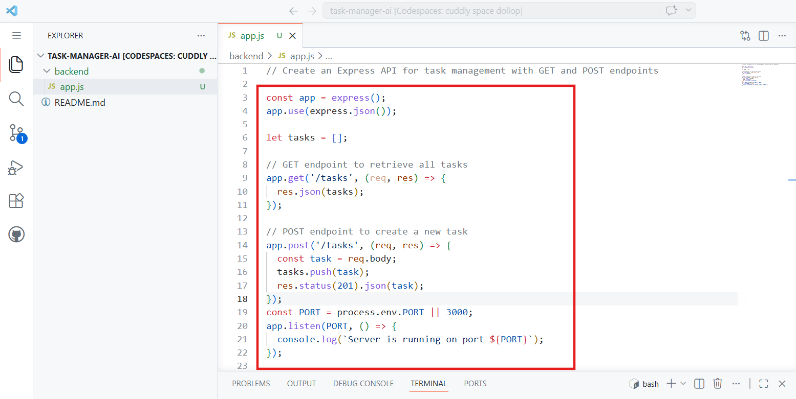
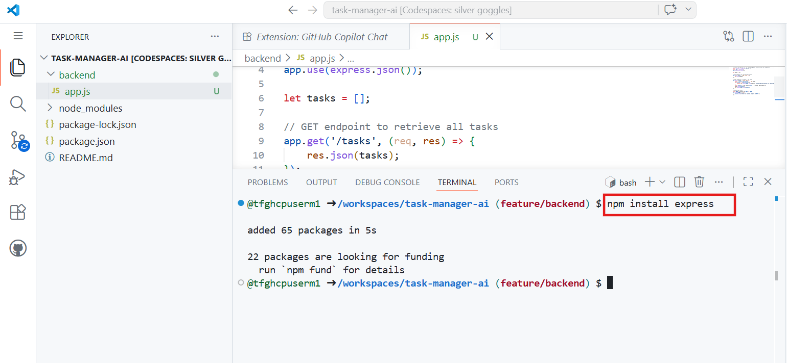
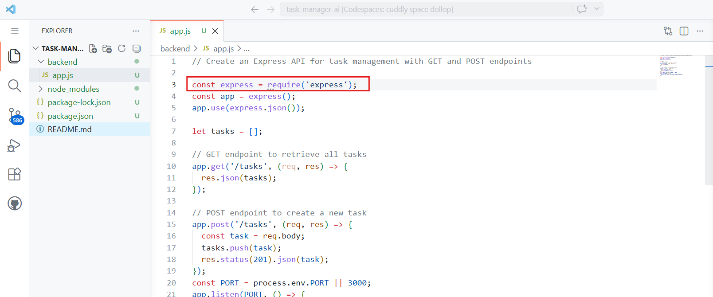
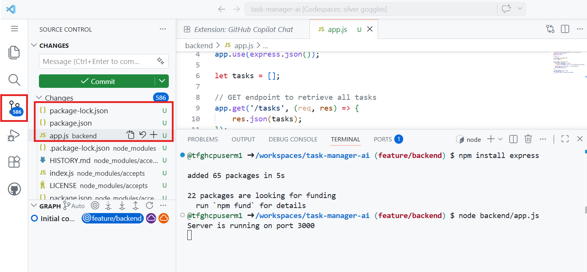
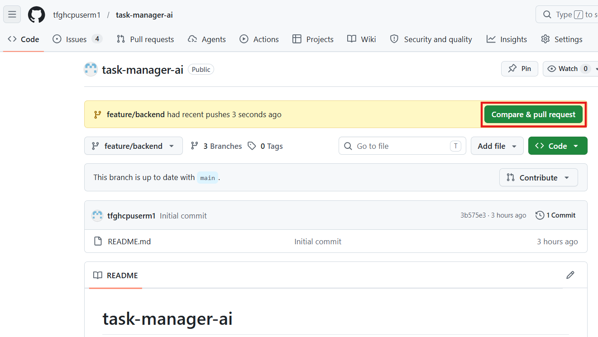
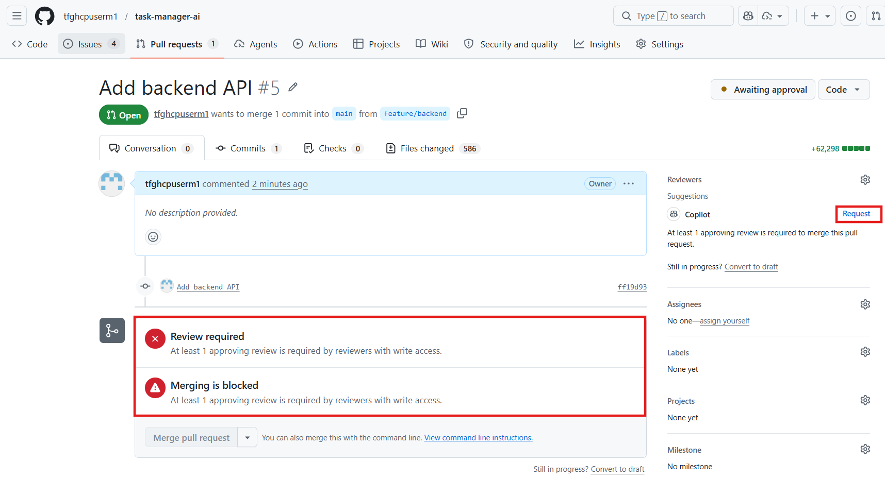
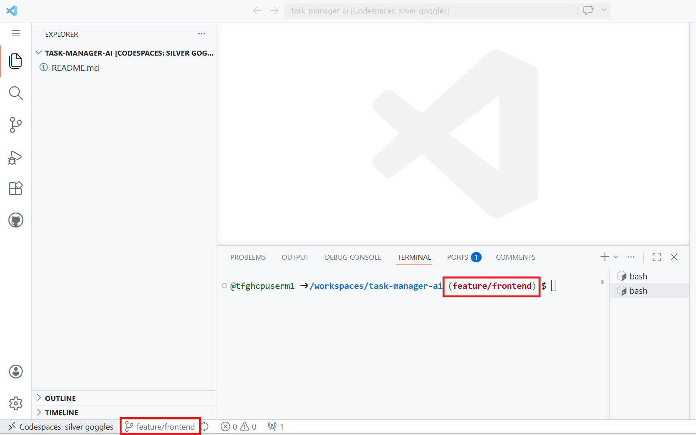
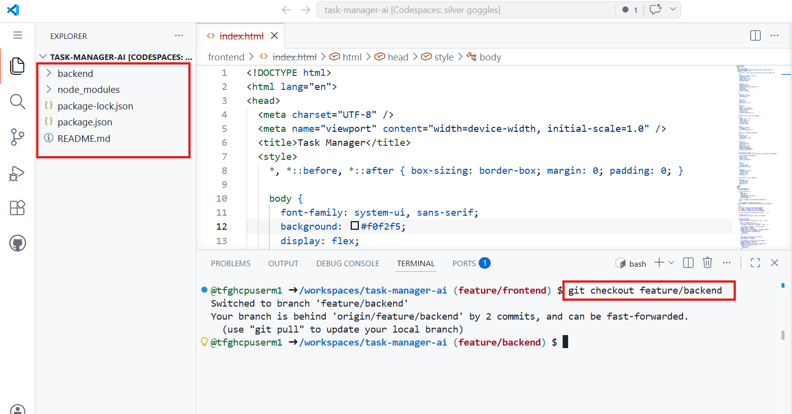
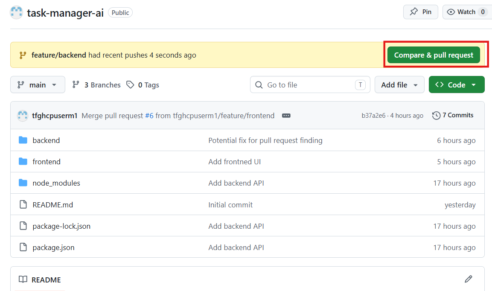

## **Lab 03: Build, Automate & Deploy a Task Manager App using GitHub + Copilot**

Zava, a fast-growing digital health company, is planning to launch a
lightweight Task Manager application to streamline internal team
operations and improve productivity across departments. As part of the
engineering team, you are responsible for building this application
using modern development practices. To accelerate delivery and maintain
high quality, Zava adopts AI-assisted development with GitHub Copilot
and implements a complete DevOps workflow using GitHub. In this lab, you
will simulate this real-world scenario by planning tasks, developing
backend and frontend components, automating CI/CD pipelines, and
deploying the application to a live environment with controlled
approvals.

### **Objectives:**

- Plan and manage project tasks using GitHub Issues and Projects

- Implement a branching strategy for collaborative development

- Build backend and frontend components using AI assistance (Copilot)

- Create and manage pull requests with automated code reviews

- Configure a CI workflow using GitHub Actions

- Debug and fix pipeline failures effectively

- Upload and manage build artifacts in workflows

&nbsp;

- Deploy the frontend application using GitHub Pages

### **Exercise 1: Project Setup and Planning**

#### **Task 1: Create a Repository in GitHub**

1.  Sign in to your [**GitHub**](https://github.com/) account.

2.  Click **"+" (top-right corner)** and select **"New repository"**.

> 

3.  Fill details:

- Enter **Repository name** → **task-manager-ai**

- Add **Description (optional)** → Task Manager with AI features

- Select repository visibility as **Public**

- Add a README file

> Click **Create repository.**
>
> 

#### **Task 2: Enable Issues and Projects**

1.  Go to **Settings** tab from the top menu in the repository.

2.  In the **General** section, scroll to ‘**Features’** section and
    check **Issues** checkbox.

3.  Similarly, also enable to **Projects** Feature.

> 

#### **Task 3: Create Issues in the repository**

1.  Navigate to **Issues** tab from the top menu and **create a new
    issue**.

**Note:** You will be creating 4 issues in the further steps.

2.  Enter the **Issue title** as **Task API** and **description** as
    ‘**Build backend API for task management (CRUD operations)**’.

Click on **Create**.

3.  Proceed with creating the **second** **issue** by clicking on **New
    issue** button.

> 

4.  Enter the **Issue title** as **UI Page** and **description** as
    ‘**Create frontend UI for task manager**’.

Click on **Create**.

5.  Create **third** **issue**.

6.  Enter the **Issue title** as **Add Tests** and **description** as
    ‘**Add unit and integration tests**’.

Click on **Create**.

7.  Create **fourth issue**.

8.  Enter the **Issue title** as **Deploy App** and **description** as
    ‘**Deploy application to cloud platform’**

Click on **Create**.

9.  You have created four issues.

> 

#### **Task 4: Create Project Board**

1.  Navigate to **Projects** tab from the top menu and **create a new
    project**.

2.  Select **Board** option.

3.  **Rename** the project as **Task Manager Board** and click **Create
    project**.

4.  By default, project board creates columns – **Todo/ In progress/
    Done.**

**Notice that Issues are already linked to your project.**

#### **Task 5: Setup Branch Strategy**

1.  Go back to the **Projects** tab.

2.  Navigate to **Repositories** tab and select **Task-Manager-ai**
    repository.

3.  Make sure you are on the **Code** tab. Expand the **main** branch
    dropdown.

4.  In the search box, type **feature/backend**.

You’ll see – **Create branch: feature/backend from ‘main’. Click that
option.**

5.  Backend Branch created successfully.

6.  Click the **branch** **dropdown** again and first select main branch
    and then, type **feature/frontend**.

Click – **Create branch: feature/frontend from ‘main’.**

7.  Frontend branch is created successfully.

8.  Go to **Settings** tab from the top menu and select **Branches**
    from the sidebar.

Under **Branch protection rules**, select **Add branch** ruleset.

9.  Enter **ruleset** **name** as **Protect main branch**.

10. Under **Target branches** dropdown, select **Include by pattern**.

11. Enter **main** branch as naming pattern and click **Add inclusion
    pattern**.

12. Enable **Require Pull request before merging**.

13. **Create** the ruleset.

You now have the **protected main** branch and two new branches –
**feature/backend** and **feature/frontend.**

### **Exercise 2: Build Application using Copilot**

#### **Task 1: Build Backend (AI-assisted)**

1.  Navigate to the **Code** tab and switch the branch to
    **feature/backend**.

> 

2.  From the **Code** dropdown, create a **new codespace**.

3.  Wait for a few minutes to load all the dependencies and packages.

4.  Navigate to **Extensions** tab from the left pane and install the
    GitHub Copilot extension.

5.  Again, navigate to **Explorer** tab and create **a new folder** and
    name it as **backend**.

6.  Select the folder and click on **new file** option and name it as
    **app.js**

7.  Open **app.js** file and enter this **comment**:

**// Create an Express API for task management with GET and POST
endpoints**

8.  Press **Enter** to see the copilot’s suggestions and press **Tab**
    to accept the suggestions. Your code should look similar as it is in
    the image below.

9.  Open the **Terminal** and install **Express** by running the below
    command:

**npm install express**

10. Make sure **express** is imported in app.js file by adding the below
    code as the first line of your file: (Ignore if it’s already there)

> **const express = require('express');**
>
> 

11. Now, run the application:

**node backend/app.js**

> You should see something like**: Server running on port 3000**
>
> 

12. Go to **Source Control** icon (left sidebar) and you’ll see changes
    in **backend/app.js** and **package.json**

13. Enter commit message: **Add backend API** and commit the changes.

14. Click **Yes** to stage all you changes and commit them directly.

15. **Sync** the committed changes.

16. Click **OK** to confirm.

17. Go to the GitHub repository and you’ll receive a **pull request**
    notification.

18. Keep the title as it is and create a pull request.

19. After creating the pull request, select **Copilot** under the
    **Reviewers**. Here, we are requesting copilot for the review before
    merging the pull request.

20. After a few minutes, copilot will review and suggest the changes.
    You can either commit the suggestions or resolve the conversation if
    you don’t want to commit.

21. You can now proceed with **merging** the pull request.

22. Confirm the merge.

23. Pull request successfully merged and closed.

#### **Task 2: Build Frontend (AI-assisted)**

1.  Navigate to your **codespace** again and change the branch to
    **feature/frontend**.  
    Select **feature/backend** branch from the bottom left corner.

2.  Then, switch to **feature/frontend** branch. Notice the branch name
    changed to frontend in the bottom left corner. Also, you can open a
    new terminal see the branch name you are associated with.

3.  Create **a new folder** named **frontend** just like you did in the
    previous task for backend.

4.  Under the **frontend** folder, create a file named as **index.html**

5.  Open **Copilot chat** and make sure **Agent** mode is selected.
    Write the prompt as:

***Create a simple UI to add and list tasks using JavaScript***

6.  Copilot will add the related code in index.html file. Keep the
    changes.

7.  Navigate to **Source Control** tab. Add a **commit message** as
    **Add frontend UI** and **commit** the changes.

8.  Click **Yes** to stage all your changes and commit them directly.

> 

9.  **Sync** the committed changes.

10. Click **OK** to confirm.

11. Switch to the **GitHub repository** and create a **pull request**.

12. Keep the title as it is and create a pull request.

13. Before merging the pull request, you can get it reviewed with
    copilot. Click **Request** under **Reviewers**.

14. Copilot will share the review feedback. You can commit the
    suggestions or merge the pull request directly.

15. **Merge** the pull request.

16. **Confirm** the merge. Here, you’ll be merging the frontend into the
    main branch.

17. Pull request is successfully merged and closed.

### **Exercise 3: CI/CD with GitHub Actions** 

#### **Task 1: Generate workflow using Copilot**

1.  For this task, you need to switch to the feature/backend branch
    again. Run the below command:

**git checkout feature/backend**

2.  Create a new folder as **.github**.

3.  Again, under .github folder – create another folder as
    **workflows**.

4.  Under the workflows folder, create a new file as **ci.yml**

5.  Open copilot chat and enter the prompt:

Create a simple GitHub Actions CI workflow for a Node.js app.

The project has no tests or build step.

It should:

- Run on push to main

- Install dependencies

- Run a basic node command to verify the app

6.  **Keep** the file changes and review the code generated by copilot
    that it must have trigger on push, Install dependencies and run
    build.

7.  Navigate to **Source control** tab. Add the commit message –
    ‘**Added CI workflow’** and commit the changes.

> 

8.  Click **Yes** to stage all your changes and commit them directly.

9.  **Sync** the changes.

10. Click **OK** to confirm.

11. Create a pull request.

12. Merge the pull request.

#### **Task 2: Break the pipeline**

13. Once the pull request is merged, go to **Actions** tab check if the
    CI workflow is successful.

14. Navigate to the Codespace again and open **ci.yml** file and add
    these below code at the end of the file.

> **- name: Break the pipeline intentionally**
>
> **run: exit 1**
>
> 

15. Add a **commit message** and **commit** the changes like you did
    previously.

16. Open a **pull request** and **merge** the changes.

17. Once merged, navigate to the Actions tab and you’ll see the **Action
    failure** because of the exit code 1.

18. Now, open the **copilot chat** in your **codespace** and enter the
    below prompt:

**Why did my workflow fail and how to fix it?**

19. Copilot will let you know the reason of the failure and to fix – it
    will tell you to update the file and remove the added code. Make
    sure you keep the file changes.

20. Now, again you can **commit** the changes to verify the Actions.

21. Open a pull request and merge the changes.

22. Navigate to the Actions tab again and you’ll the succeeded status on
    the recent action. Surprisingly, Copilot can fix the errors as well!

23. 

### **Exercise 4: Deploy to Production**

#### **Task 1: Deploy Frontend to GitHub Pages**

Host your **frontend/index.html** live using GitHub Pages.

1.  Navigate to **Code** tab and edit the **ci.yml** file.

2.  **Add deployment step**. Add the below code at the end of **steps**:

**- name: Deploy Pages**

**uses: peaceiris/actions-gh-pages@v3**

**with:**

**github_token: ${{ secrets.GITHUB_TOKEN }}**

**publish_dir: ./frontend**

3.  Add this at the **top of file** below **name**. Without this the
    deployment will fail.

**permissions:**

**contents: write**

4.  **Commit** the changes and write the **commit message** as: **Add
    GitHub Pages deployment and create a pull request.**

5.  **Merge** the pull request.

6.  Go to **settings** and select **Pages** section. Under Deploy from
    branch, select **gh-pages** branch from the dropdown. **Save** the
    changes.

7.  Navigate to **Actions** tab and select the recent **pages build and
    deployment** workflow.

8.  Once the status shows succeeded, click the deployed url similar to
    **https://\<your-username\>.github.io/task-manager-ai/**

9.  This will open a new tab in your browser and you’ll that **FRONTEND
    IS LIVE**!

### **Conclusion**

This lab provides a comprehensive understanding of how modern
development teams build, automate, and deploy applications using DevOps
practices. By integrating AI-assisted coding with CI/CD pipelines and
deployment strategies, you experienced how to accelerate development
while maintaining quality and control. The use of GitHub for version
control, automation, and hosting demonstrates how a single platform can
support the entire software delivery lifecycle, preparing you for
real-world development and deployment scenarios.
