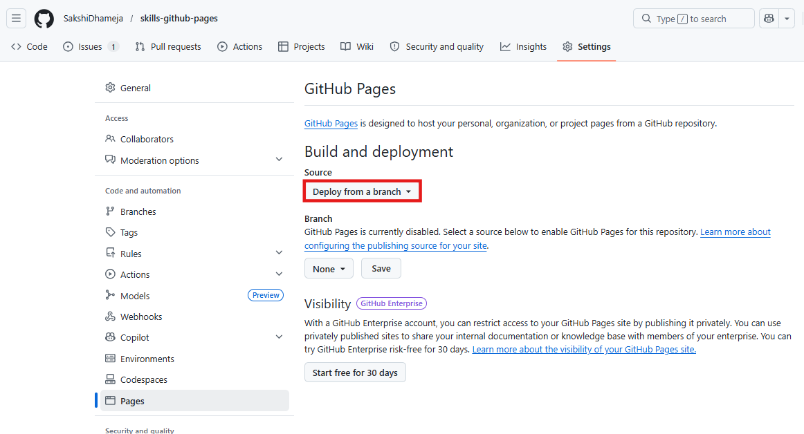
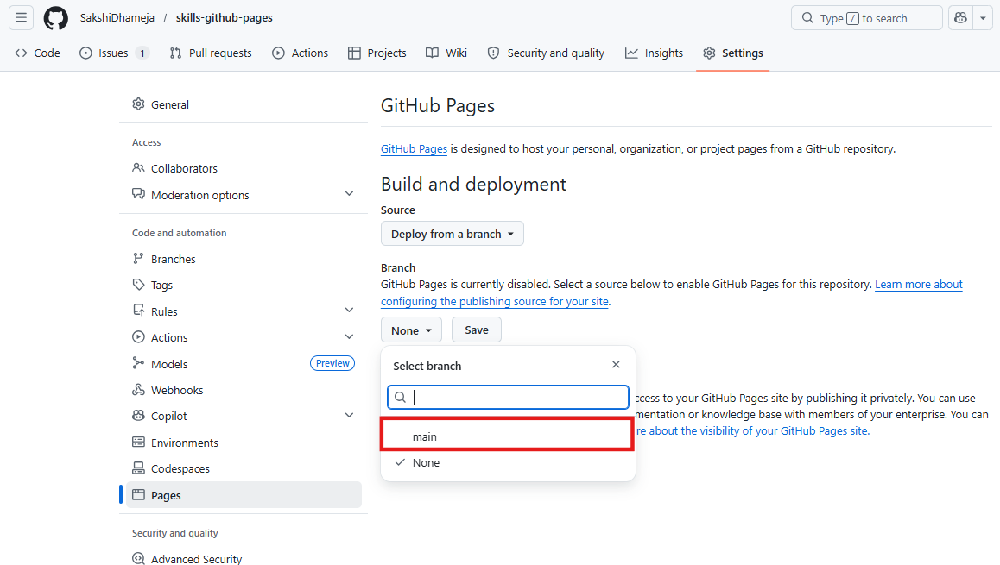
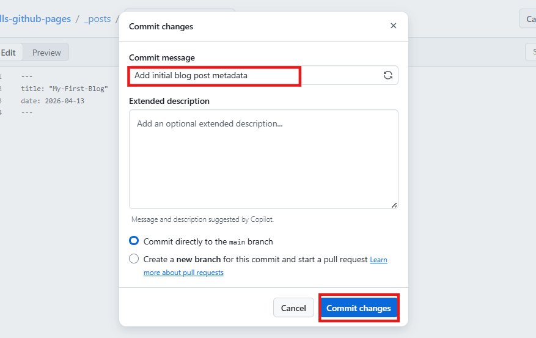

# Lab 04: Building and Managing a Website with GitHub Pages and DevOps Practices

Zava, a growing digital solutions company, wants to establish an online
presence to showcase its projects, share updates, and publish technical
blogs. The development team has decided to use GitHub Pages as a quick
and efficient way to host and manage their website directly from their
code repository. As a DevOps engineer at Zava, your task is to enable
and configure the website, customize its appearance, and ensure
continuous updates through version control practices. By completing this
lab, you will help Zava build and maintain a live, professional website
using GitHub Pages.

### **Objectives:**

- Enable GitHub Pages to publish a repository as a live website

- Configure site settings such as theme, title, and metadata

- Customize the homepage

- Create and publish a blog post following the required structure

- Manage and apply updates using commits and version control

### **Exercise 1: Enable GitHub Pages**

1.  Sign in to your GitHub account.

2.  Browse to the following link: [skills/github-pages: Create a site or
    blog from your GitHub repositories with GitHub
    Pages.](https://github.com/skills/github-pages?tab=readme-ov-file)
    and click on **Copy exercise**.

3.  Keep the repository name as is and make sure the repository is set
    to be **Public**. Click on **Create repository**.

> 

4.  Open this repository and under your repository name, click
    **Settings**.

> 

5.  Click **Pages** in the **Code and automation** section.

> 

6.  Ensure **Deploy from a branch** is selected from
    the **Source** drop-down menu.

> 

7.  Then, select **main** from the **Branch** drop-down menu.

> 

8.  Click the **Save** button.

> 
>
> 

### **Exercise 2: Customize your homepage**

You can customize your homepage by adding content to index.md file. As
you commit it to the main branch your website will be updated to display
your personalized content!

1.  After a few seconds, **refresh** the page to get the **link to your
    website** at the top of the Pages section of your repository
    settings.

> 

2.  Keep your GitHub
    Pages [website](https://sakshidhameja.github.io/skills-github-pages/) open
    in a separate browser tab and keep it handy! As you progress through
    this exercise, you'll see your changes reflected on your live site.

> 

3.  Switch to the GitHub repository and navigate to **Code** tab.

> 

4.  Browse to the **index.md** file in the **main** branch.

> 

5.  In the upper right corner, open the **file editor**.

> 

6.  Type the content you want on your homepage ‘**This is my first
    Blog**.’ and **commit** the changes to the main branch.

> 

7.  Add the commit message and again, **commit** the changes.

> 

8.  After a few seconds, refresh your website and verify if the content
    is reflecting on the website.

> 

### **Exercise 3: Configure your site**

Nice work updating your home page. It's time we give it a little bit
of **configuration** so it looks nice!

1.  Browse to the **\_config.yml** file in the main branch.

> 

2.  In the upper right corner, open the file editor.

> 

3.  Add a **theme**: set to **minima** so it shows in
    the **\_config.yml** file as below:

**theme: minima**

> 

4.  You can modify the other configuration variables such
    as title:, author:, and description: to further customize your site.
    After this, commit the changes.

title: Mark Brown's personal blog

> description: This is where I share cool stuff about my life
>
> author: MarkBrown
>
> 

5.  **Review** the commit message generated by copilot and **commit**
    the changes again.

> 

6.  Navigate to the website tab on your browser and refresh the page.
    You’ll notice that the **website theme is changed now** and also,
    notice the title, description and author name is reflecting on the
    website.  
      
    

### **Exercise 4: Create a blog post**

1.  Browse to the main branch by clicking on the **Code** tab.

> 

2.  Click the **Add file** dropdown menu and then on **Create new
    file**.

> 

3.  Name the file following the **\_posts/YYYY-MM-DD-title.md** format.
    Replace the YYYY-MM-DD with today's date, and change the title of
    your first blog post as ‘**FirstBlog’.**

> **Note:** If you do edit the title, make sure there are hyphens (-)
> between your words. If your blog post date doesn't follow the correct
> date convention, you'll receive an error and your site won't build.
>
> 

4.  Type the following content at the top of your blog post:

- Replace **YOUR-TITLE** with the title for your blog post.

- Replace **YYYY-MM-DD** with today's date.

> **---**
>
> **title: "YOUR-TITLE"**
>
> **date: YYYY-MM-DD**
>
> **---**
>
> 

5.  **Commit** the changes.

> 

6.  Review the commit message and commit the changes.

> 

7.  After committing the changes, navigate to the website tab on your
    browser and notice that your **blog URL** is now attached to your
    website. Moreover, you can try adding the contents to your blog.

> 

### **Conclusion**

By completing this lab, you successfully helped Zava establish its
online presence using GitHub Pages. You enabled the website, configured
its settings, customized the homepage, and published a blog post,
demonstrating how updates can be managed efficiently through version
control. These steps reflect real-world DevOps practices, allowing
Zava’s team to continuously improve and maintain their website with
ease.
