# Lab 10 : Debugging and fixing a buggy Node.js REST API with GitHub Copilot

### Scenario 

You have just joined a mid-size development team as a backend developer.
Your team lead has assigned you a **Node.js Express REST API** for an
e-commerce **Order Management System** that a junior developer built
before leaving the company. The API is riddled with bugs — it crashes on
certain endpoints, returns incorrect data, has security vulnerabilities,
lacks input validation, and has no unit tests.

Your task is to **use GitHub Copilot** as your AI pair-programming
assistant to systematically identify, understand, and fix all the bugs —
then add proper test coverage and documentation before the next sprint
review.

**This is NOT a coding fundamentals exercise.** You are expected to
understand JavaScript/Node.js. The lab teaches you **how to leverage
GitHub Copilot effectively** for real-world debugging workflows.

###  Objectives

By the end of this lab, you will be able to:

1.  Use **Copilot Chat** (/explain) to rapidly understand unfamiliar,
    buggy code

2.  Use **/fix** slash command to generate targeted bug fixes

3.  Write effective natural-language prompts to get Copilot to identify
    security vulnerabilities

4.  Use **/tests** to generate comprehensive unit tests for fixed code

5.  Use **/doc** to generate inline documentation

6.  Evaluate Copilot suggestions critically — accepting, modifying, or
    rejecting them

7.  Experience an end-to-end debugging workflow powered by GitHub
    Copilot


## Task 1: Understand the Problem (Human Reasoning First)

**Objective:** Before using Copilot, assess the situation as a
developer.

**Instructions:**

1.  Open the project in VS Code.Open Terminal ->GitBash and run below command to clone the repo

    +++ git clone https://github.com/technofocus-pte/buggy-order-api-lab.git+++
2.  Attempt to start the server:

    +++cd buggy-order-api/+++
    
    +++npm start+++

3.  The server will crash on startup due to a route configuration
    errors.

    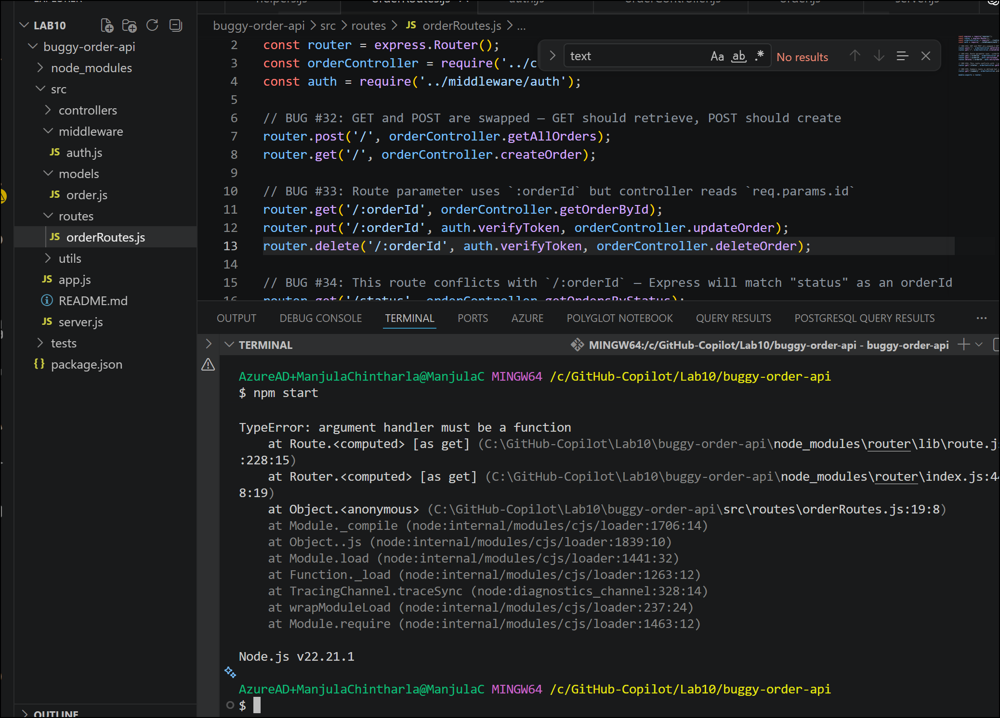

4.  Route handlers are validated during startup.An undefined controller
    method can crash the app before any API calls occur.

5.  **Before using Copilot**, write down:

    - Does the server start? (No)
    
    - What error occurs?
    
    - Which file is referenced in the stack trace?
    
    - Why would Express reject a route definition?

6.  *Do not move on to endpoint testing until startup‑level issues are
    resolved.*

7.  Open terminal and run below command to create a new branch for your
    fixes:
 
     +++git checkout -b fix/debug-with-copilot+++

## Task 2: Use GitHub Copilot to Analyze and Explore the Codebase

**Objective:** Use Copilot Chat as an interactive AI assistant, helping
you debug issues with natural language queries.​

1.  Open **src/models/order.js** in the editor.Select **all the
    code** in the file.Open Copilot Chat and type:

     +++/explain+++

    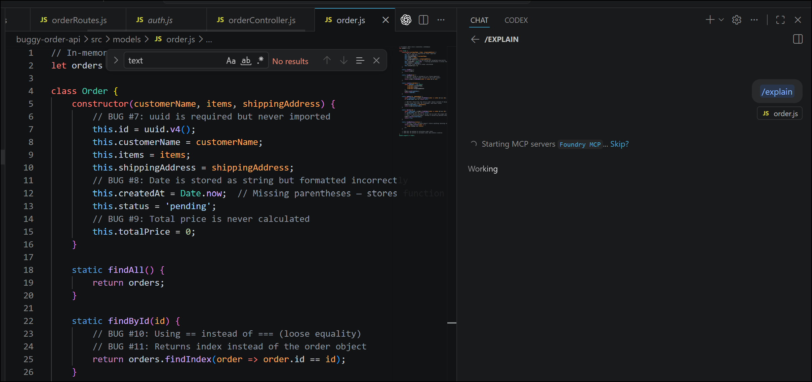

2.  Read Copilot's explanation carefully. It should identify:

    - Missing uuid import

    - Date.now vs Date.now()

    - findById returning index instead of object

    - splice misuse

3.   Use /explain for a step-by-step breakdown of a complex function.​
    Does Copilot catch ALL the bugs? Note which ones it misses — this is
    where developer expertise matters.

    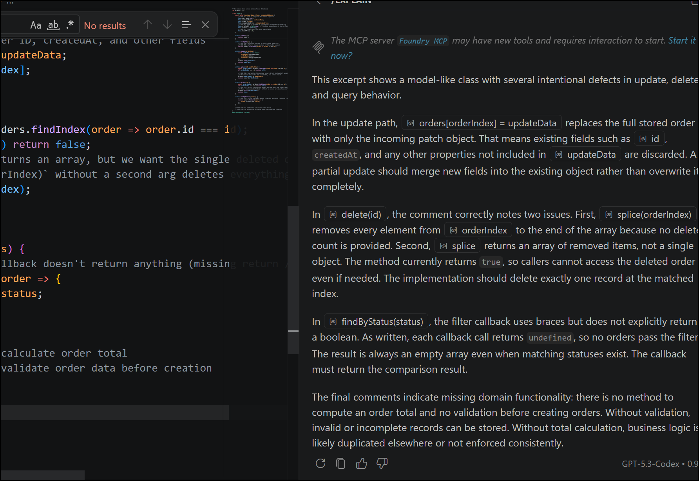

4.  Highlight the **findByStatus** method in order.js.In Copilot Chat,
    ask:

    +++Why does this filter method always return an empty array?+++

    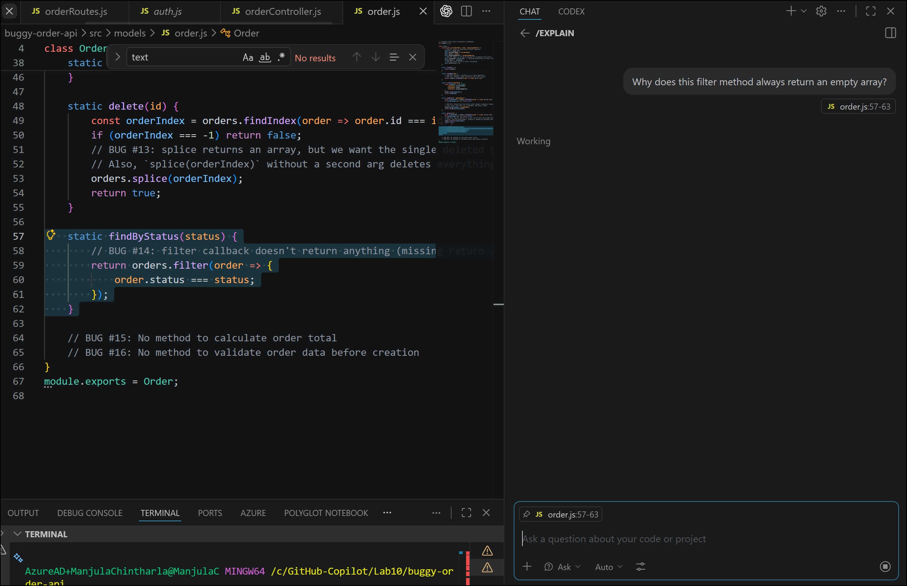

5.  Copilot should explain that the arrow function body with curly
    braces needs an explicit return statement, or the curly braces
    should be removed.

    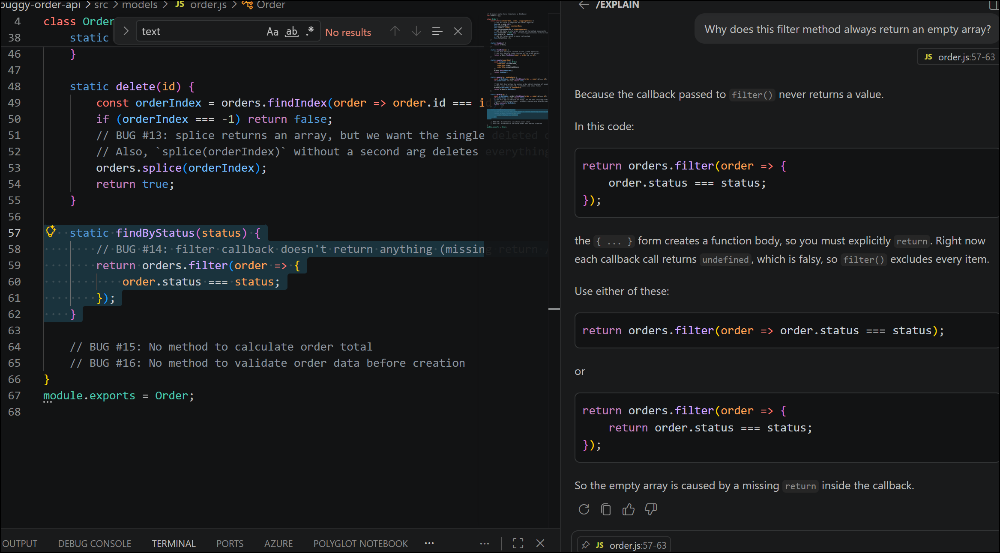

6.  Open **src/middleware/auth.js**.In Copilot Chat, type:

    +++Analyze this authentication middleware for security vulnerabilities and best practice violations+++

    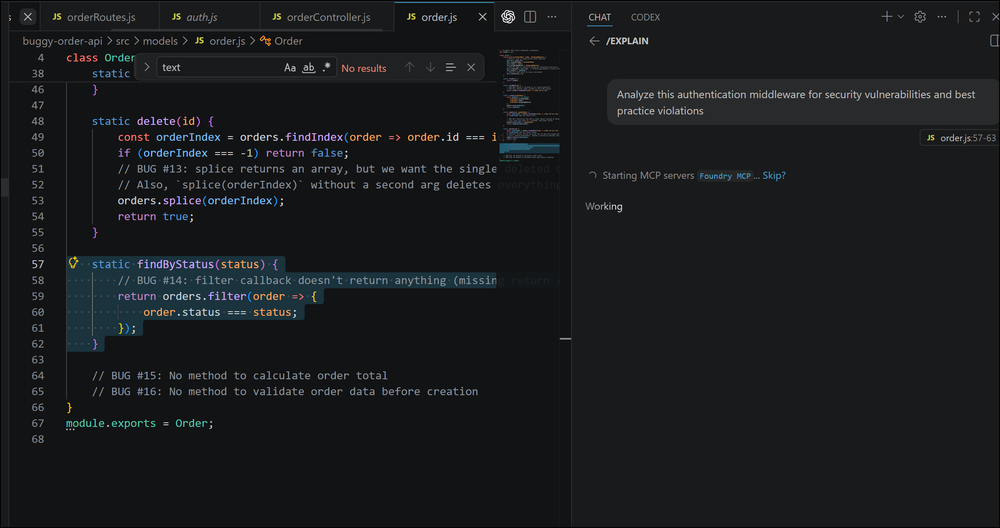

7.  **Evaluate Copilot's response.** It should identify:

    - No actual token verification (JWT or otherwise)

    - Wrong HTTP status code (403 vs 401)

    - Case-sensitive header access

    - No user info extraction from token

    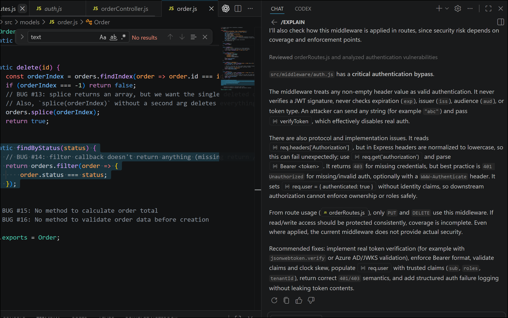

Note**:** Copilot may suggest implementing full JWT verification. For
this lab, decide whether a simple token check is sufficient for a
prototype or if you should implement proper JWT. **This is your call,
not Copilot's.**

## Task 3 — Use Copilot to Generate Fixes src/app.js 

**Objective:** Systematically fix each file using
Copilot's /fix command, inline suggestions, and Copilot Chat prompts.
Select the code causing issues, type /fix, and let Copilot Chat generate
suggestions

1.  **Open** **src/app.js** in the editor.**Select all code** in the
    file and type in Copilot Chat in Agent mode.

    +++/fix Review this Express app configuration. It is missing critical middleware and has a route prefix typo. Fix all issues.+++

    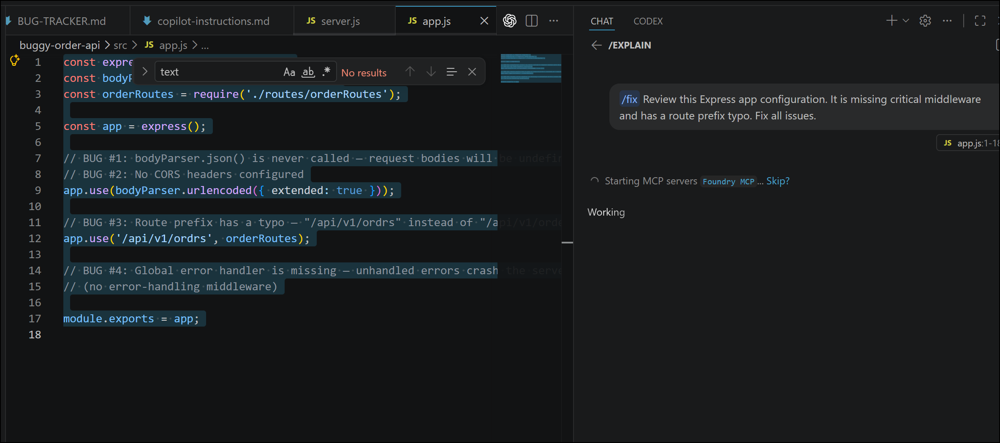

2.  **Review Copilot's suggestions.** It should propose and fix the
    issues.

    - Adding app.use(bodyParser.json()); before routes

    - Adding CORS middleware (either cors package or manual headers)

    - Fixing '/api/v1/ordrs' → '/api/v1/orders'

    - Adding a global error-handling middleware at the bottom

    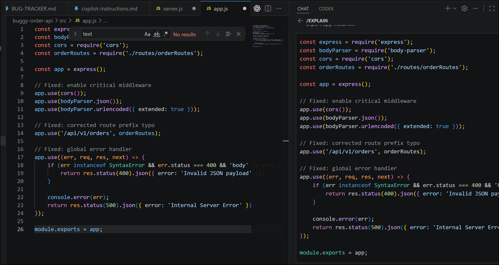

3.  Open Terminal and Install the CORS package if Copilot suggested it:

    +++npm install cors+++

    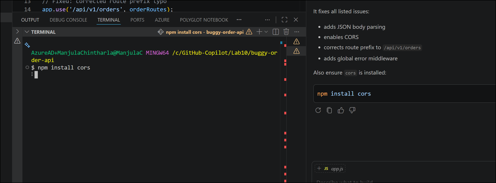

4.  **Update your Bug Tracker:** Mark Bugs \#1–#4 as and note which
    Copilot feature you used.

Note**:** Copilot may suggest various CORS configurations. For a
development API, permissive CORS is fine. For production, you'd restrict
origins. **This decision is yours**, not Copilot's.

## Task 4 — Use Copilot to Generate Fixes  src/server.js 

1.  **Open** src/server.js.**Select all code** and use Copilot Chat
    Agent mode

    +++/fix This server file has a hardcoded port and no graceful shutdown.Add environment variable support and proper signal handling.+++

    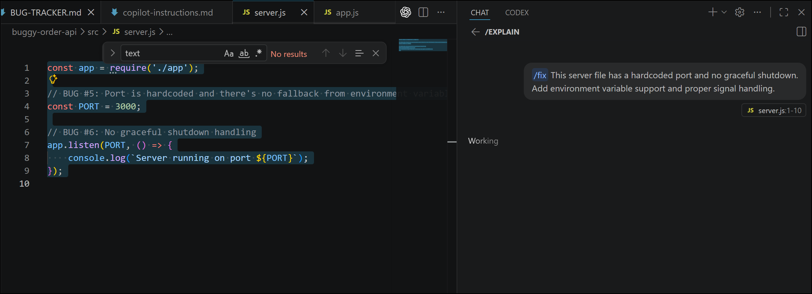

2.  **Review and apply fixes.**

    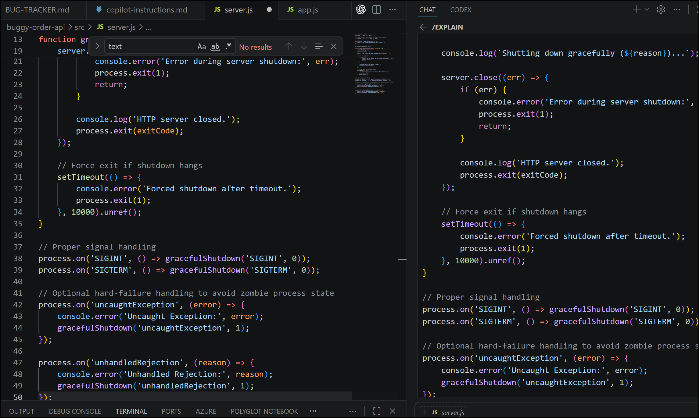
    
    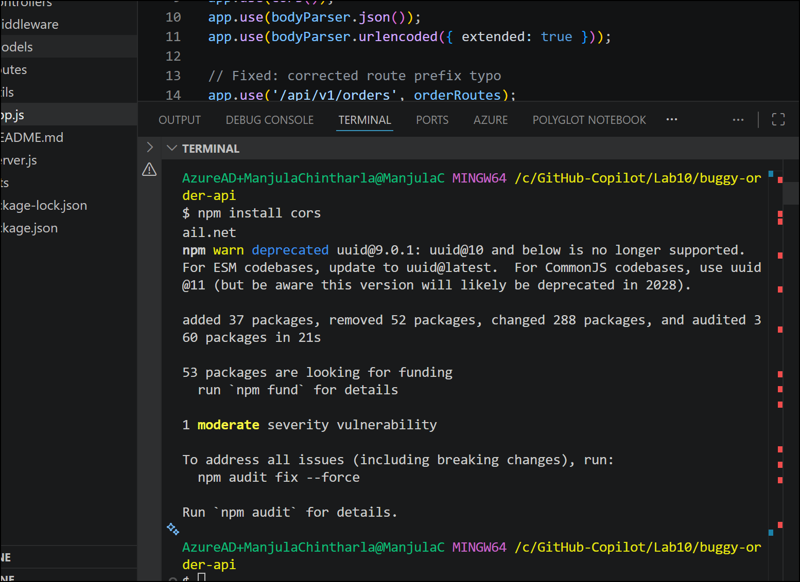

3.  **Update Bug Tracker:** Mark Bugs \#5–#6 as 🔧.

## Task 6 — Use Copilot to Generate Fixes in src/models/order.js  — The Most Critical File

This file contains **10 bugs** and is the core of the application. We'll
fix it in stages.**Fix Critical Crashes (Bugs \#7, \#8)**

1.  **Highlight the constructor** of the Order class.In Copilot Chat:

    +++/fix This constructor crashes because uuid is never imported and  Date.now is missing parentheses. Also, totalPrice should be calculated from items.+++

    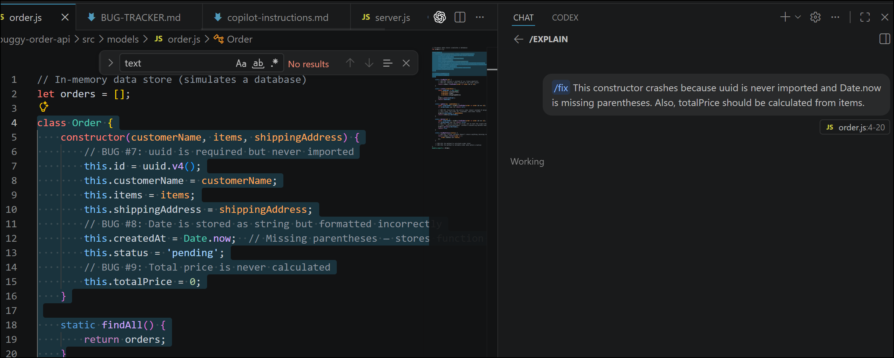

2.  **Verify** Copilot adds const { v4: uuidv4 } = require('uuid'); at
    the top and changes Date.now to Date.now() or new Date().

    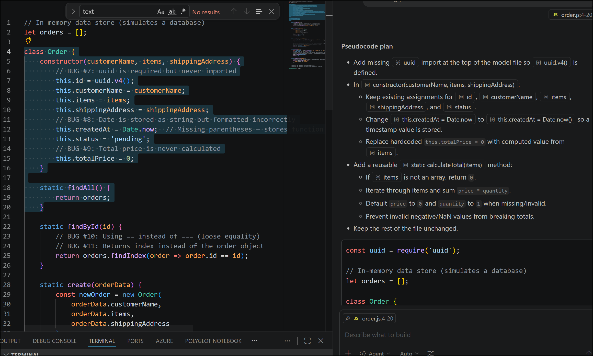
    
    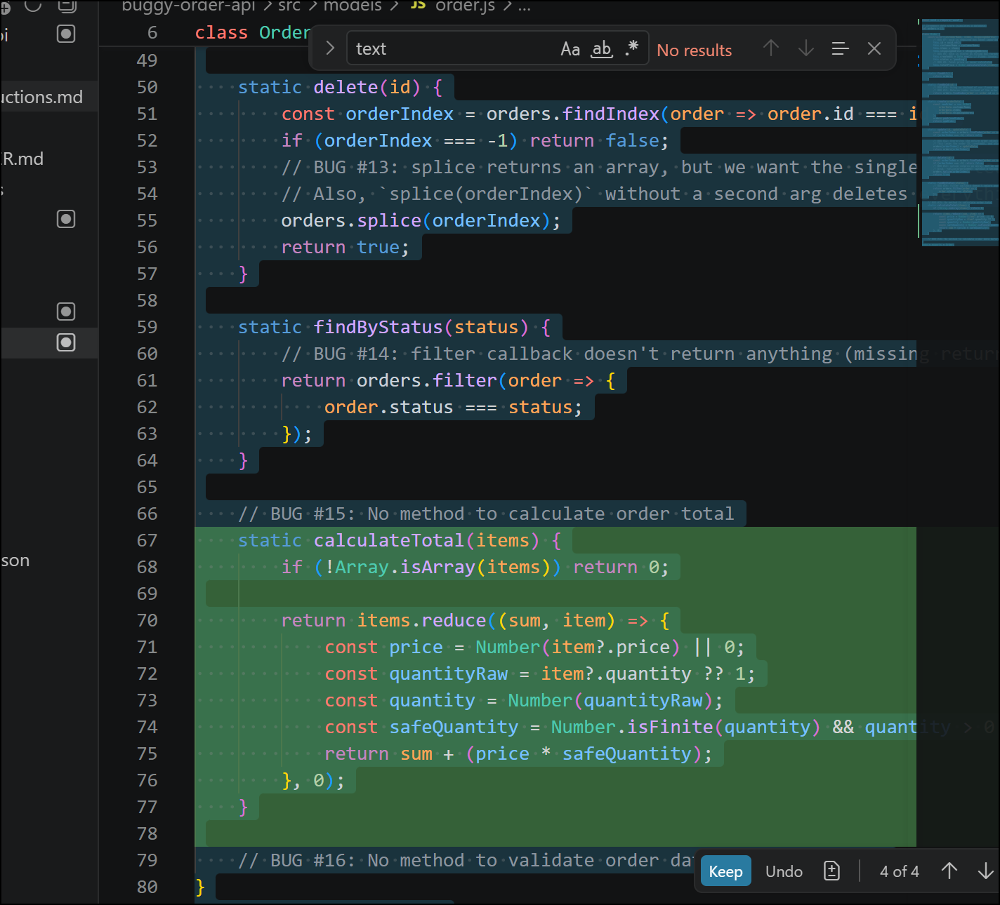

**Stage C: Fix update Method (Bug \#12)**

1.  **Highlight** the update method.Use **inline
    chat** (press Ctrl+I / Cmd+I on the selection):

    +++Fix this: it overwrites the entire order with updateData, losing the original fields like id and createdAt. It should merge properties instead.+++
    
    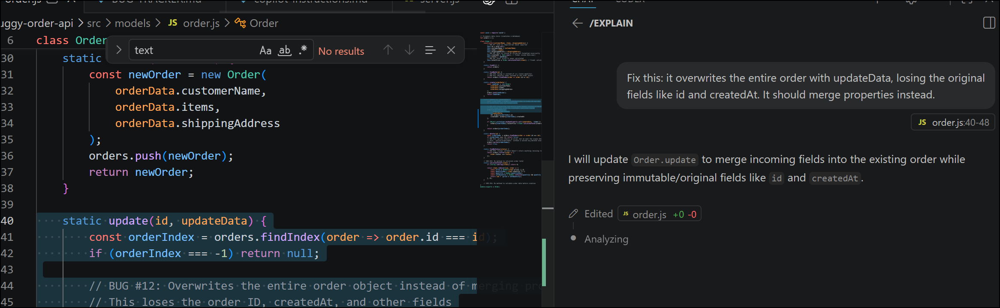

2.  Review the suggested fix and accept it

    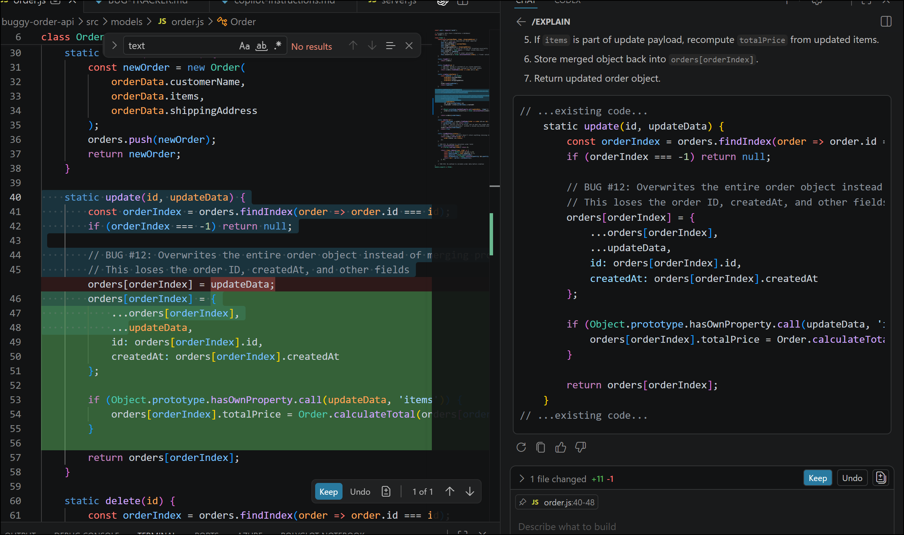

**Stage E: Fix findByStatus (Bug \#14)**

1.  **Highlight** the findByStatus method. Copilot should have fixed it
    as shown

    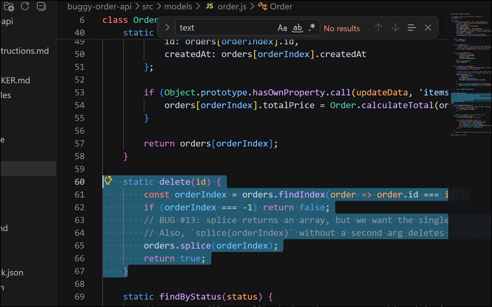

Note**:** The bug was curly braces without
a return statement. Copilot should explain that =\> { expression
} needs return, while =\> expression returns implicitly.

**Stage F: Add Missing Methods (Bugs \#15, \#16)**

1.  Place your cursor at the bottom of the class, **before the closing }**.

2.  Type the following **comment prompt** to trigger Copilot inline
    suggestions:

    +++// Calculate the total price of an order by summing price quantity for each item+++

3.  **Wait for Copilot's ghost text suggestion** and press Tab to accept
    if it looks correct.

     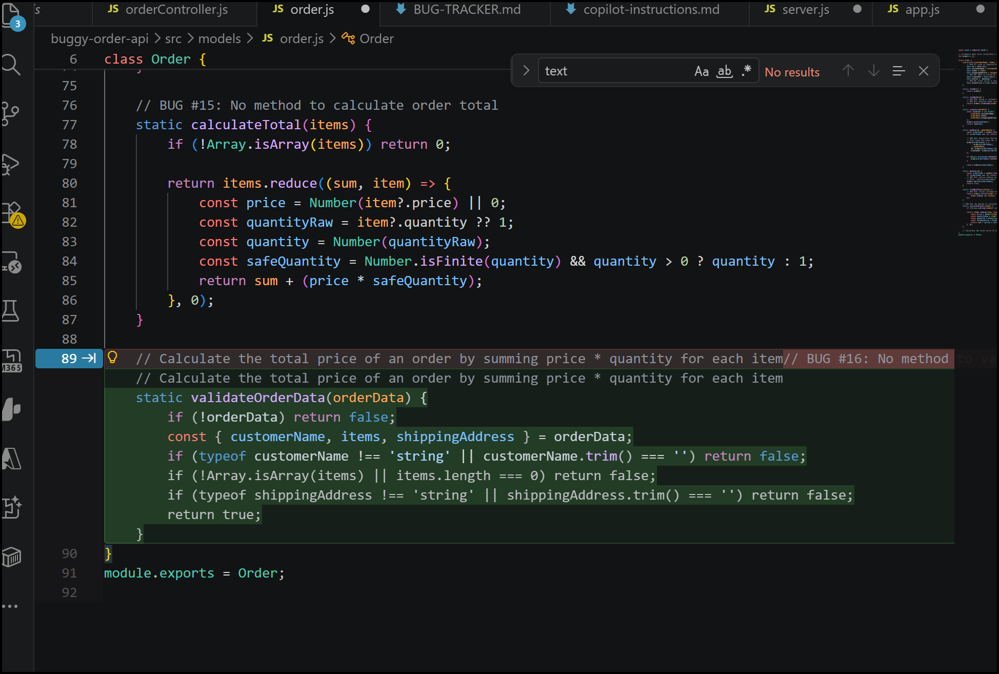

4.  Then type another comment:

    +++// Validate order data: customerName, items (non-empty array), and shippingAddress are required+++

5.  Accept or refine Copilot's suggestion.

6.  **Update Bug Tracker:** Mark Bugs \#7–#16 with the status

## Task 7 — Use Copilot to Generate Fixes src/controllers/orderController.js 

**Stage A: Fix createOrder (Bugs \#20–#23)**

1.  **Highlight** the createOrder method.In Copilot Chat:

    +++/fix This createOrder method has no input validation, returns wrong HTTP status code (200 instead of 201), and has incorrect error handling.Fix all issues and add proper validation using the helpers module.+++

    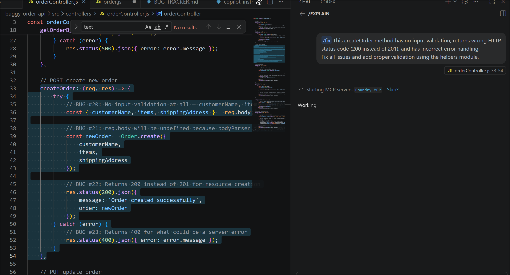

2.  **Review** Copilot's output. Expected improvements:

    - Import helpers at the top

    - Validate customerName, items, shippingAddress before creating

    - Return 201 status code

    - Proper error handling with 500 for server errors

3.  Fixed code should like

     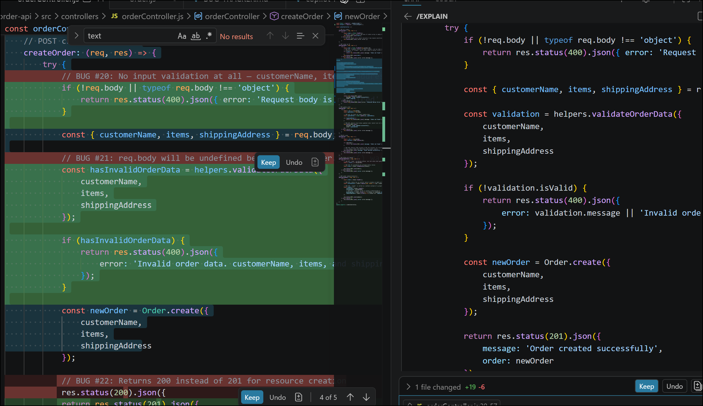

**Stage C: Fix getOrdersByStatus (Bugs \#27–#28)**

1.  **Highlight** the getOrdersByStatus method.In Copilot Chat in Agent
    mode

    +++/fix This reads status from req.params but the route sends it as a query parameter. Also add validation for allowed status values: pending, processing, shipped, delivered, cancelled.+++

    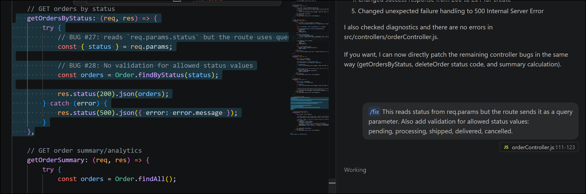

2.  Review and accept the fix.

    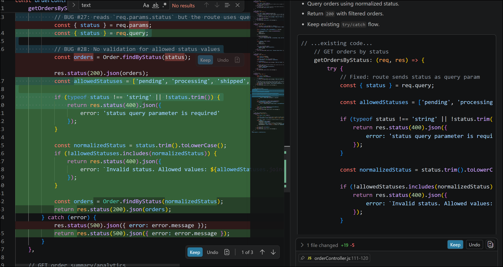

**Stage D: Fix getOrderSummary (Bugs \#29–#31)**

1.  **Highlight** the **getOrderSummary** method.

2.  In Copilot Chat:

    ```
    /fix This method has three bugs: >
    1. reduce() crashes on empty array (no initial value)
    2. .length() is called as a method instead of a property
    3. 'pending' is not in quotes - it's a ReferenceError
    Fix all three.
    ```
    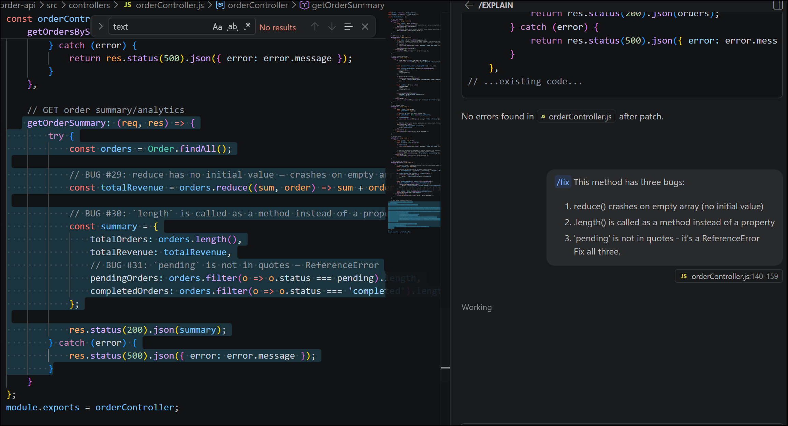

3.  Review and accept the fix

    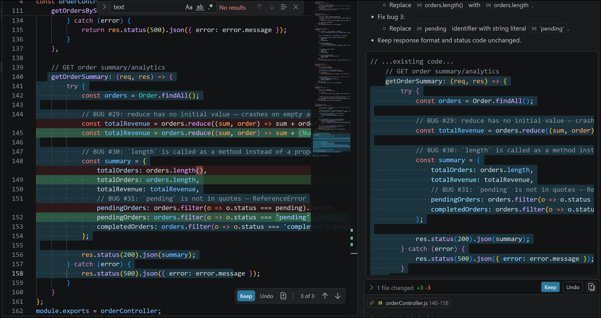

**Update Bug Tracker:** Mark Bugs \#17–#31 as 🔧.

## Task 8 — Use Copilot to Generate Fixes src/routes/orderRoutes.js 

1.  **Open** orderRoutes.js and **select all code**.In Copilot Chat, use
    a comprehensive prompt:
    ```
    /fix This route file has the following issues:
     1. GET and POST methods are swapped on the root route
     2. Route parameter is :orderId but controllers expect :id
     3. /status route conflicts with /:orderId pattern (Express matches status" as an orderId)
     4\ Summary route references wrong controller method name  (orderSummary vs getOrderSummary)
     Fix all issues and ensure route ordering prevents conflicts.
    ```
    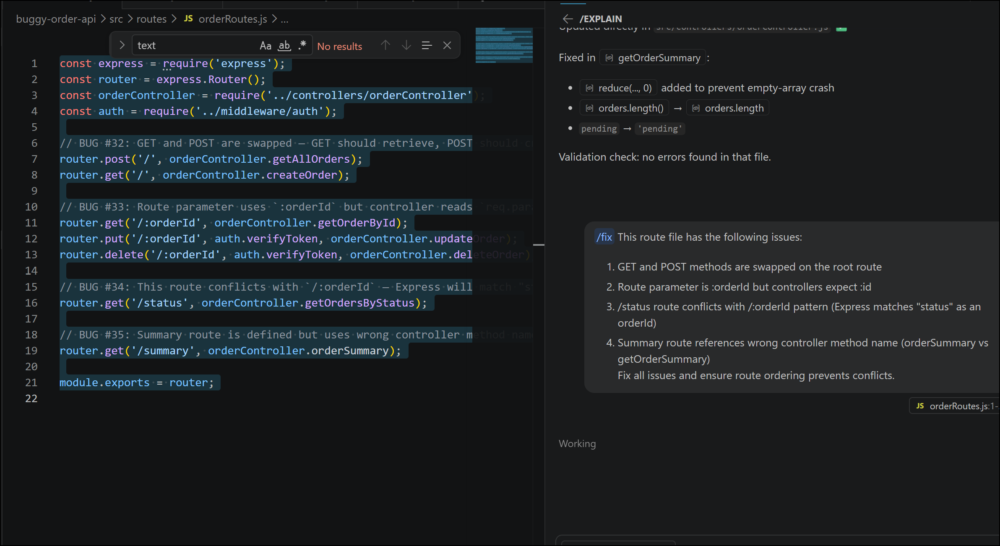

2.  Review the fix and accept it.

    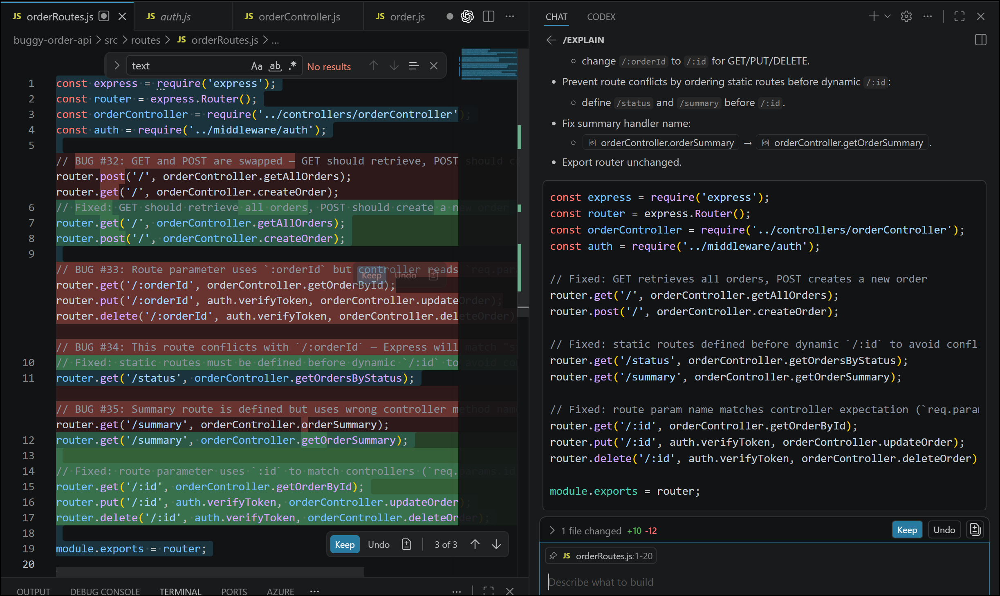

    Note**:** Notice how route ordering matters in Express. Copilot is
    recognizing patterns and suggesting solutions based on what it has
    learned.​[**2**](https://github.blog/ai-and-ml/github-copilot/how-to-debug-code-with-github-copilot/)​
    But understanding **why** /status must come before /:id requires your
    knowledge of Express route matching.

3.  **Update Bug Tracker:** Mark Bugs \#32–#35 with the status.

## Task 9 — Use Copilot to Generate Fixes  src/middleware/auth.js 

1.  **Open** auth.js and **select all code**.In Copilot Chat:

    ```
    /fix This auth middleware has security issues:
    1. req.headers\['Authorization'\] should be lowercase 'authorization'
    2. Returns 403 when it should return 401 (no token = unauthorized,not forbidden)
    3. No actual token verification — just checks if token exists
    4. Never extracts user info from token
    Implement proper JWT token verification using jsonwebtoken library.
    ```
    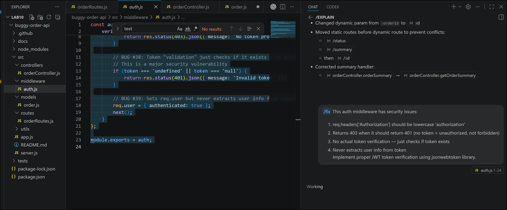

2.  Review and accept the fix.

    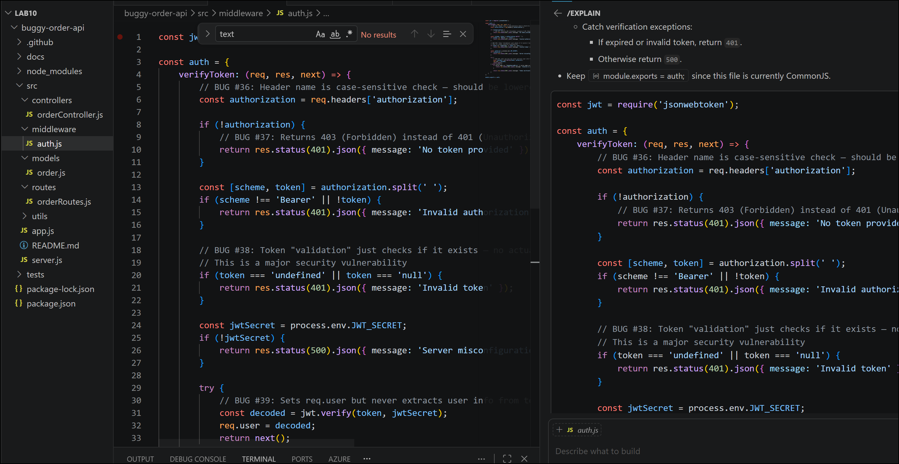

3.  **Open termina and run below command to Install jsonwebtoken**

    +++npm install jsonwebtoken+++

     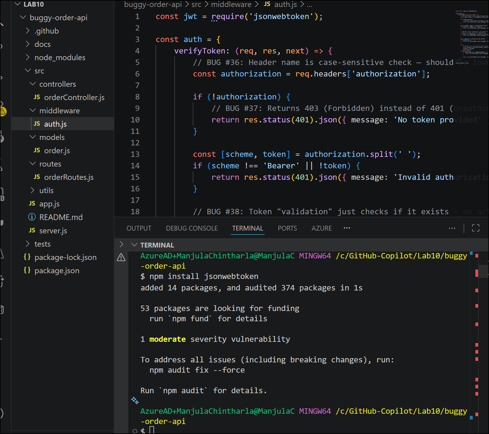

 **Update Bug Tracker:** Mark Bugs \#36–#39 withthe status

**Note:** Copilot may suggest different JWT configurations. For this
lab, a simple HS256 token with environment-variable secret is fine. In
production, you'd use RS256 with key rotation. **This architecture
decision is yours.**

## Task 10 — Use Copilot to Generate Fixes src/utils/helpers.js 

This file has **11 bugs**. Let's use Copilot agent mode — the next
evolution in AI-assisted coding that performs multi-step coding tasks at
your command, analyzing your codebase, reading relevant files, proposing
file
edits.​[**3**](https://code.visualstudio.com/blogs/2025/02/24/introducing-copilot-agent-mode)​

**Option A: Using Copilot Agent Mode (Recommended)**

1.  Select the full code from src/utils/helpers.js toand enter below
    prompt in Agent mode
    ```
    Fix all bugs in helpers.js:
    1. calculateTotal: uses for...in instead of for...of, multiplies price\*price instead of price\*quantity, has floating point issues
    2. validateOrderData: validation logic is completely inverted (returns true for invalid, false for valid)
    3. isValidStatus: has typos ("shiped", "cancled"), and is case-sensitive without toLowerCase()
    4. paginate: off-by-one error, page should be 1-based for users,slice end index is wrong
    5. formatOrderResponse: calls toISOString() on a function reference Add input sanitization to formatOrderResponse to prevent XSS.
    ```
    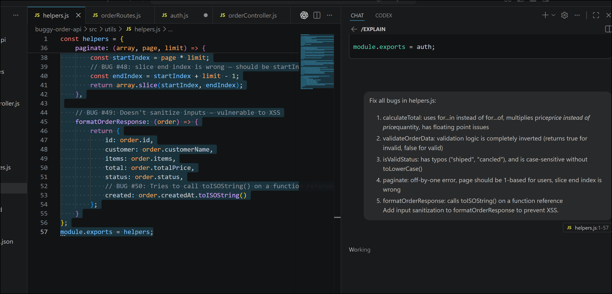

2.  Review the proposed changes — every tool invocation is transparently
    displayed in the UI.​

    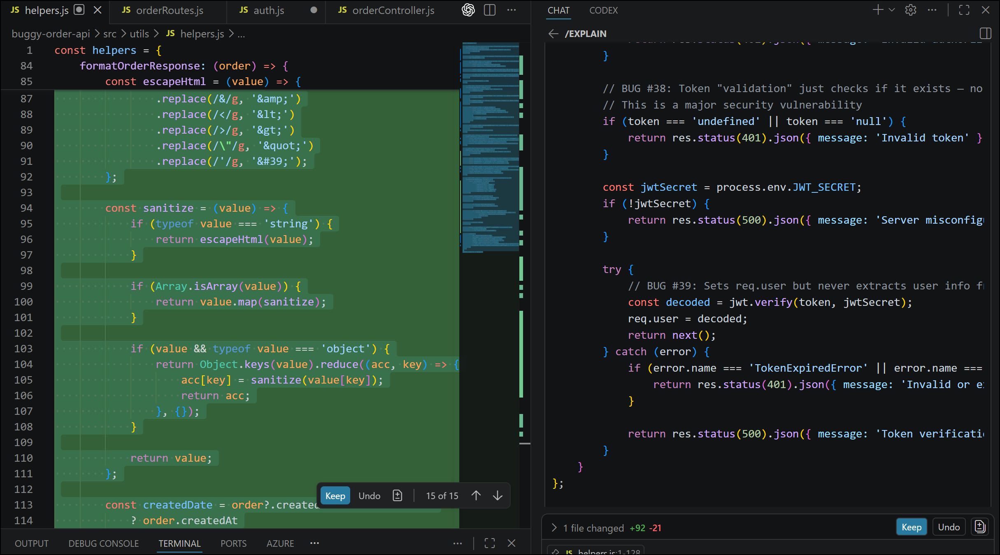

3.  Use +++/fix++ in Agent mode and fix the pending issues

4.  Now , run the server

    +++npm start+++
    
    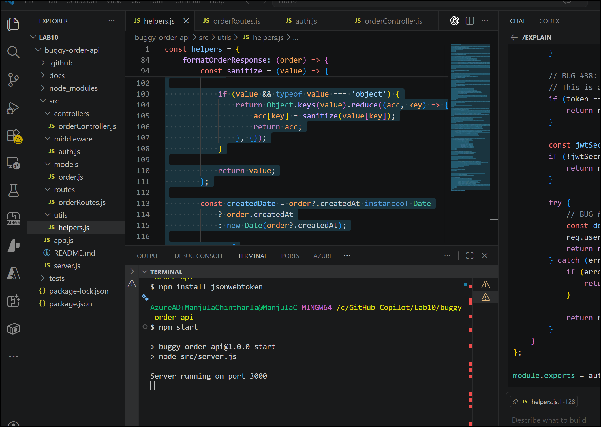

5.  Duplicate a workspace and run below command to create order

    ```
    curl -i -X POST http://localhost:3000/api/v1/orders -H "Content-Type:
    application/json" -d
    '{"customerName":"Alice","items":\[{"name":"Book","price":10.5,"quantity":2}\],"shippingAddress":"123
    Main St"}'
    ```
    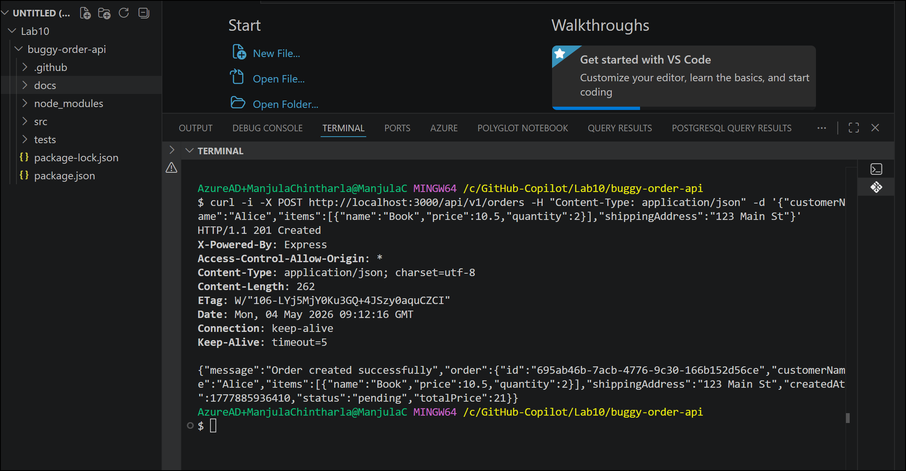

6.  Repalce <<YOUR WORKBENCH PATH>> with your workbenach path and run below command to read all orders

    ```
    curl
     -i [http://localhost:3000/api/v1/orders](vscode-file://vscode-app/c:<<YOUR WROKBENCHURL>>)
    ```
    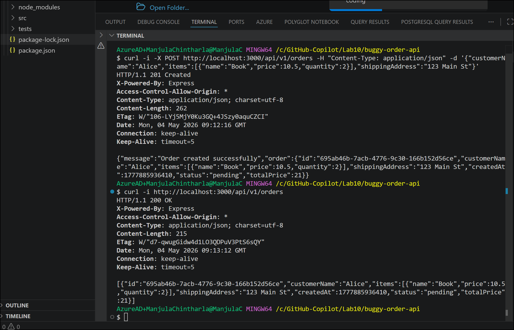

3.  Validate summary route  
    curl
    -i [http://localhost:3000/api/v1/orders/summary](vscode-file://vscode-app/c:/Users/<<YOUR WORKBENCH PATH>>)

    Expected: 200 OK with totals
    
    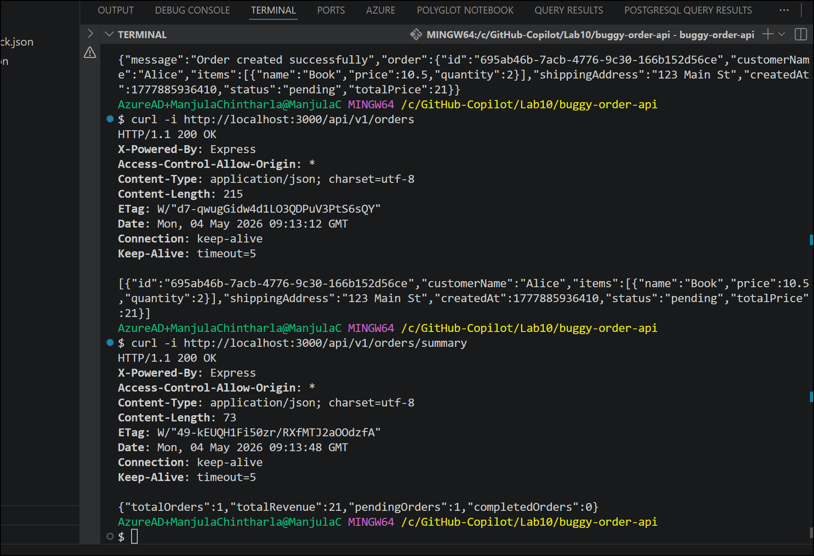
